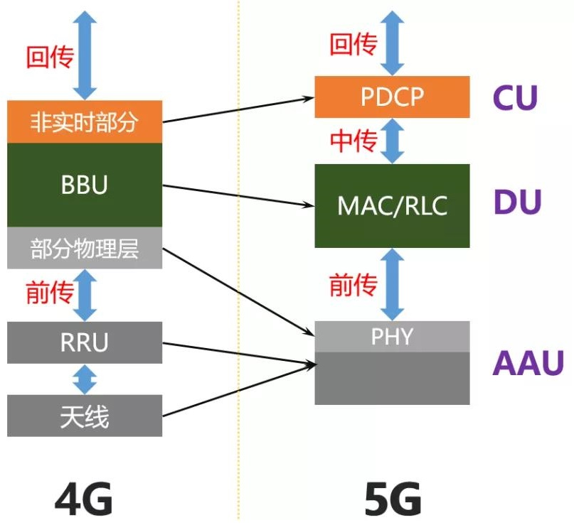

# 5G

### 在5G网络中，接入网不再是由BBU、RRU、天线这些东西组成了。而是被重构为以下3个功能实体：
- CU（Centralized Unit，集中单元）
  CU：原BBU的非实时部分将分割出来，重新定义为CU，负责处理非实时协议和服务。
- DU（Distribute Unit，分布单元）
  DU：BBU的剩余功能重新定义为DU，负责处理物理层协议和实时服务。
- AAU（Active Antenna Unit，有源天线单元）
  AAU：BBU的部分物理层处理功能与原RRU及无源天线合并为AAU。

  
  

### references
1. [5G核心网](https://app.yinxiang.com/fx/a7afa44c-dfc6-4140-8a41-deefe2c6cb66)
1. [NFV的五大矛盾](https://app.yinxiang.com/fx/0b3167c1-d976-4c5b-a54f-b30a2fb6a3fe)
1. [E2E Network Slicing](https://app.yinxiang.com/fx/5b4b59cd-6b79-4b80-b6d3-26904270f58b)
1. 

