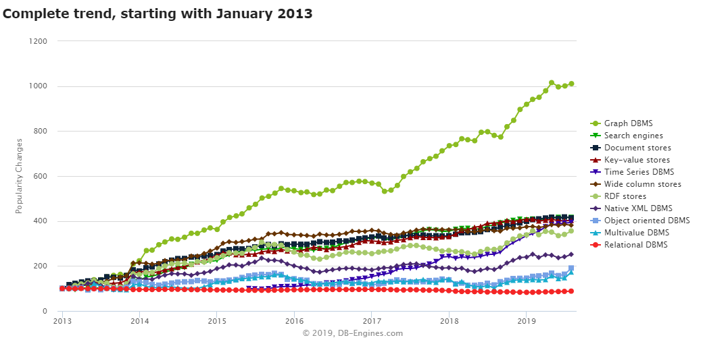
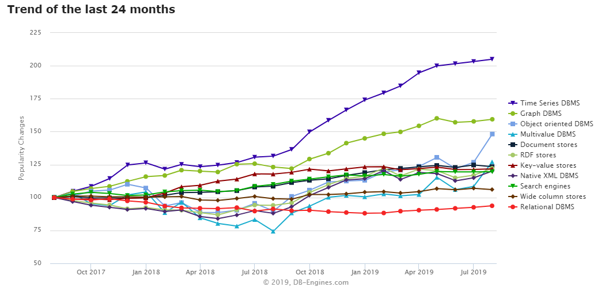

# 数据库

```
KISS - Keep It Simple & Stupid；
```

数据被快速制造和消费，数据看上去更加无秩序，或叫非结构化，据说超过80%，且持续加速增加，于是新的非关系型DB/noSQL快速崛起


#### :question:
- 类型
- 特点
- 选型


#### 数据库类型
```
- Relational DBMS
  - oracle,mysql,postgreSQL,hive
- Key-value stores
  - redis,memcached
- Document stores/document-oriented database
- Graph DBMS
  - neo4j,Microsoft Azure Cosmos DB
- Time Series DBMS
  - InfluxDB,Kdb+,Prometheus,Graphite,RRDtool,OpenTSDB,Druid
- Object oriented DBMS
- RDF stores
- Search engines
  - Elasticsearch,Splunk
- Wide column stores
 - Cassandra,hbase
- Multivalue DBMS
- Native XML DBMS
- Event Stores
- Content stores
- Navigational DBMS
```

#### Document stores database
also called document-oriented database systems, are characterized by their schema-free organization of data.
Records do not need to have a uniform structure, i.e. different records may have different columns.
The types of the values a€?a€?of individual columns can be different for each record.
Columns can have more than one value (arrays).
Records can have a nested structure.
Document stores often use internal notations, which can be processed directly in applications, mostly JSON. 
JSON documents of course can also be stored as pure text in key-value stores or relational database systems. 
That would, however, require client-side processing of the structures, which has the disadvantage that the features offered by document stores (such as secondary indexes) are not available.
<br>存储文档数据库，也叫面向文档数据库，主要特点是非结构化、数据的自由组织
纪录可以非结构化，比如不同纪录中的可以有不同的列，不同列的数据类型也可以不同，列的数据可以是多个值，比如一个array，记录还可以是嵌套结构。
比如方便直接存储JSON数据，key-value数据库也可以存储JSON数据，但客户需要自己处理数据结构，这样就容易失去JSON数据组织的优点，比如第二个索引

#### kafka & redis

## 消息系统
:question:
- 异步
- 解耦
- 顺序

kafka通过zookeeper来存储集群的meta信息






#### references
1. [db ranking](https://db-engines.com/en/ranking)
1. [influxDB vs. openTSDB](http://blog.fatedier.com/2016/07/06/test-influxdb-and-opentsdb/)
1. [openTSDB](http://blog.fatedier.com/2016/07/04/research-of-time-series-database-opentsdb/)
1. [恒丰银行——大数据实时流处理平台](http://www.sohu.com/a/148106853_400678)
