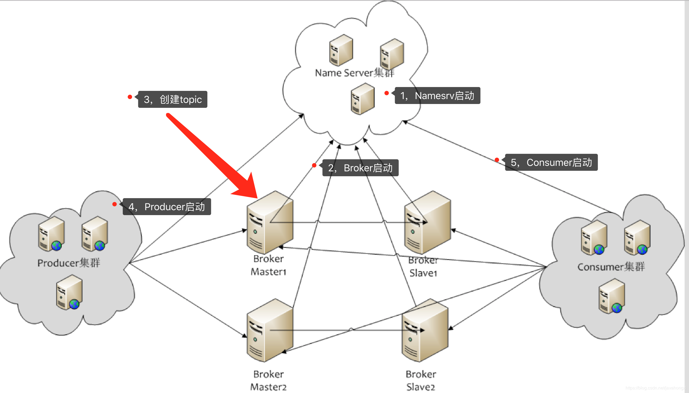
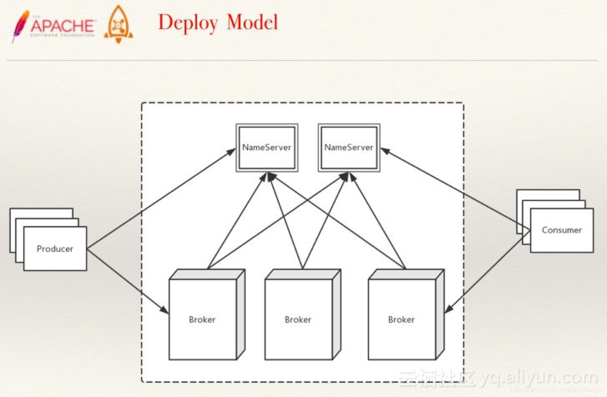

# 消息系统

### kafka

:question:
- 异步
- 解耦
- 顺序
- 削峰填谷

kafka是个日志处理缓冲组件，在大数据信息处理中使用。和传统的消息队列相比较简化了队列结构和功能，以流形式处理存储（持久化）消息（主要是日志）。日志数据量巨大，处理组件一般会处理不过来，所以作为缓冲曾的kafka，支持巨大吞吐量。为了防止信息都是，其消息被消防后不直接丢弃，要多存储一段时间，等过期时间过了才丢弃。这是mq和redis不能具备的。
kafka通过zookeeper来存储集群的meta信息

### rocketMQ

心跳机制
- 自带name service，脱离zookeeper，自动Master选举
- broke与所有nameSVR保持心跳请求，30s间隔，2min无心跳，nameSVR判定broke下线，调整topic与broke关系
- Consumer跟Broker是长连接，会每隔30秒发心跳信息到Broker。
  Broker端每10秒检查一次当前存活的Consumer，若发现某个Consumer 2分钟内没有心跳， 就断开与该Consumer的连接，并且向该消费组的其他实例发送通知，触发该消费者集群的负载均衡(rebalance)。
- producter每30秒从Namesrv获取Topic跟Broker的映射关系，更新到本地内存中。
  再跟Topic涉及的所有Broker建立长连接，每隔30秒发一次心跳。 
  在Broker端也会每10秒扫描一次当前注册的Producer，如果发现某个Producer超过2分钟都没有发心跳，则断开连接

### zookeeper

它是一个分布式服务框架，是Hadoop的一个子项目，主要是用来解决分布式应用中经常遇到的一些数据管理问题，如：统一命名服务、状态同步服务、集群管理、分布式应用配置项的管理等。

惊群问题

运维参数

参数名|说明
---|---
clientPort|客户端连接server的端口，即对外服务端口，一般设置为2181吧。 
dataDir|存储快照文件snapshot的目录。默认情况下，事务日志也会存储在这里。建议同时配置参数dataLogDir, 事务日志的写性能直接影响zk性能。 
tickTime|ZK中的一个时间单元。ZK中所有时间都是以这个时间单元为基础，进行整数倍配置的。例如，session的最小超时时间是2xtickTime。 
dataLogDir|事务日志输出目录。尽量给事务日志的输出配置单独的磁盘或是挂载点，这将极大的提升ZK性能。（No Java system property） 
globalOutstandingLimit|最大请求堆积数。默认是1000。ZK运行的时候， 尽管server已经没有空闲来处理更多的客户端请求了，但是还是允许客户端将请求提交到服务器上来，以提高吞吐性能。当然，为了防止Server内存溢出，这个请求堆积数还是需要限制下的。  (Java system property:zookeeper.globalOutstandingLimit. ) 
preAllocSize|预先开辟磁盘空间，用于后续写入事务日志。默认是64M，每个事务日志大小就是64M。如果ZK的快照频率较大的话，建议适当减小这个参数。(Java system property:zookeeper.preAllocSize ) 
snapCount|每进行snapCount次事务日志输出后，触发一次快照(snapshot), 此时，ZK会生成一个snapshot.文件，同时创建一个新的事务日志文件log.。默认是100000.（真正的代码实现中，会进行一定的随机数处理，以避免所有服务器在同一时间进行快照而影响性能）(Java system property:zookeeper.snapCount ) 
traceFile|用于记录所有请求的log，一般调试过程中可以使用，但是生产环境不建议使用，会严重影响性能。(Java system property:? requestTraceFile ) 
maxClientCnxns|单个客户端与单台服务器之间的连接数的限制，是ip级别的，默认是60，如果设置为0，那么表明不作任何限制。请注意这个限制的使用范围，仅仅是单台客户端机器与单台ZK服务器之间的连接数限制，不是针对指定客户端IP，也不是ZK集群的连接数限制，也不是单台ZK对所有客户端的连接数限制。指定客户端IP的限制策略，这里有一个patch，可以尝试一下：(http://rdc.taobao.com/team/jm/archives/1334（No Java system property)
clientPortAddress|对于多网卡的机器，可以为每个IP指定不同的监听端口。默认情况是所有IP都监听 clientPort 指定的端口。  New in 3.3.0 
minSessionTimeoutmaxSessionTimeout|Session超时时间限制，如果客户端设置的超时时间不在这个范围，那么会被强制设置为最大或最小时间。默认的Session超时时间是在2 *  tickTime ~ 20 * tickTime 这个范围 New in 3.3.0 
fsync.warningthresholdms|事务日志输出时，如果调用fsync方法超过指定的超时时间，那么会在日志中输出警告信息。默认是1000ms。(Java system property:  fsync.warningthresholdms )New in 3.3.4 
autopurge.purgeInterval|在上文中已经提到，3.4.0及之后版本，ZK提供了自动清理事务日志和快照文件的功能，这个参数指定了清理频率，单位是小时，需要配置一个1或更大的整数，默认是0，表示不开启自动清理功能。(No Java system property)  New in 3.4.0 
autopurge.snapRetainCount|这个参数和上面的参数搭配使用，这个参数指定了需要保留的文件数目。默认是保留3个。(No Java system property)  New in 3.4.0 
electionAlg|在之前的版本中， 这个参数配置是允许我们选择leader选举算法，但是由于在以后的版本中，只会留下一种“TCP-based version of fast leader election”算法，所以这个参数目前看来没有用了，这里也不详细展开说了。(No Java system property) 
initLimit|Follower在启动过程中，会从Leader同步所有最新数据，然后确定自己能够对外服务的起始状态。Leader允许F在 initLimit 时间内完成这个工作。通常情况下，我们不用太在意这个参数的设置。如果ZK集群的数据量确实很大了，F在启动的时候，从Leader上同步数据的时间也会相应变长，因此在这种情况下，有必要适当调大这个参数了。(No Java system property) 
syncLimit|在运行过程中，Leader负责与ZK集群中所有机器进行通信，例如通过一些心跳检测机制，来检测机器的存活状态。如果L发出心跳包在syncLimit之后，还没有从F那里收到响应，那么就认为这个F已经不在线了。注意：不要把这个参数设置得过大，否则可能会掩盖一些问题。(No Java system property) 
leaderServes|默认情况下，Leader是会接受客户端连接，并提供正常的读写服务。但是，如果你想让Leader专注于集群中机器的协调，那么可以将这个参数设置为no，这样一来，会大大提高写操作的性能。(Java system property: zookeeper. leaderServes )。 
server.x=[hostname]:nnnnn[:nnnnn]|这里的x是一个数字，与myid文件中的id是一致的。右边可以配置两个端口，第一个端口用于F和L之间的数据同步和其它通信，第二个端口用于Leader选举过程中投票通信。  (No Java system property) 
group.x=nnnnn[:nnnnn]weight.x=nnnnn|对机器分组和权重设置，可以  [参见这里](http://zookeeper.apache.org/doc/r3.4.3/zookeeperHierarchicalQuorums.html)(No Java system property) 
cnxTimeout|Leader选举过程中，打开一次连接的超时时间，默认是5s。(Java system property: zookeeper.  cnxTimeout ) 
zookeeper.DigestAuthenticationProvider.superDigest|ZK权限设置相关，具体参见  《  使用super  **身份对有权限的节点进行操作 **》  和  《 ZooKeeper   **权限控制 **》 
|skipACL 对所有客户端请求都不作ACL检查。如果之前节点上设置有权限限制，一旦服务器上打开这个开头，那么也将失效。(Java system property:  zookeeper.skipACL ) 
forceSync|这个参数确定了是否需要在事务日志提交的时候调用 [FileChannel ](http://rdc.taobao.com/team/%5C/java%5C/jdk1.6.0_22%5C/jre%5C/lib%5C/rt.jar%3Cjava.nio.channels(FileChannel.class%E2%98%83FileChannel).force)来保证数据完全同步到磁盘。(Java system property: zookeeper.forceSync ) 
jute.maxbuffer|每个节点最大数据量，是默认是1M。这个限制必须在server和client端都进行设置才会生效。(Java system property: jute.maxbuffer ) 

### 实验 & 性能测试 & benchmark

### references
1. [rocketmq压测](https://www.cnblogs.com/guazi/p/6661977.html)
1. [rocketmq github](https://github.com/apache/rocketmq/tree/master/docs/cn)
1. 
1. 
1. 

