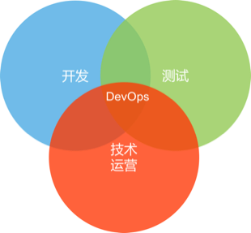
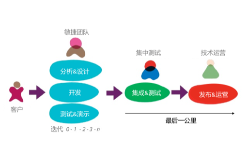
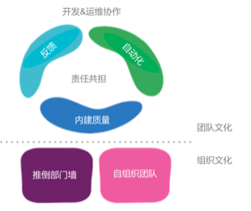
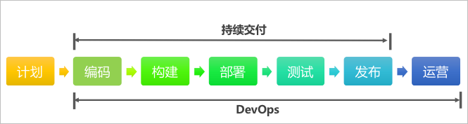
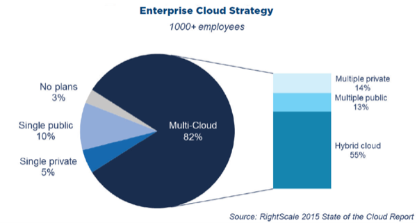
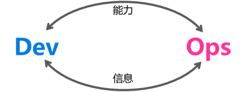
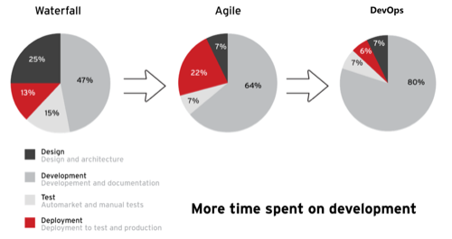

## DevOps理解

本章旨在帮助团队深入理解DevOps概念、背景和价值。DevOps在业界没有明确的定义，所以我们参考了维基百科、Martin Fowler博客等多个权威渠道，以及GENE KIM（国外DevOps权威专家）的观点，以期向大家多角度的诠释DevOps，并结合集团的实际情况，总结出我们对DevOps的理解和价值分析。

### 1. DevOps概念
#### 1.1 研发运营一体化

> DevOps是Development和Operations的组合词，它是一组过程、方法与系统的统称，用于促进开发（应用程序/软件工程）、技术运营和质量保障（QA）部门之间的沟通、协作与整合。它的出现是由于软件行业日益清晰地认识到：为了按时交付软件产品和服务，开发和运营工作必须紧密合作。  --维基百科
	

*图 1：维基百科定义的DevOps*

#### 1.2 最后一公里
DevOps核心要解决的是从代码提交到服务发布与运营这一整个阶段的问题，我们称之为最后一公里，这其中就包括了配置管理、集成、测试、部署、技术运营等领域。

*图 2：ThoughtWorks咨询师 Rouan Wilsenach描述的交付最后一公里*

#### 1.3 是技术，更是文化
DevOps更多的是一种文化，开发、测试、技术运营团队紧密合作，为了共同的目标与责任努力。

*图 3：Martin Fowler博客论述的 [DevOps文化](http://martinfowler.com/bliki/DevOpsCulture.html)*

1. 责任共担：开发、测试、技术运营，甚至包括产品经理和产品运营应该共同承担产品服务的目标和责任，团队之间不应该有壁垒，各角色的思维不再只是局限于自己的职能。
2. 自动化：DevOps强调自动化一切，这也就要求一切都可以代码化，infrastructure as code 是DevOps中的一个重要实践
3. 内建质量：质量一定不是依靠测试验证来保障和提高的，团队需要引入自动化测试、单元测试、代码审查、代码扫描等实践，在开发过程中建设质量
4. 反馈：DevOps关注不同角色之间的沟通，尤其是生产环境监控是一个很有用的反馈循环，它可以帮助诊断问题和发现潜在改进点

#### 1.1.4 DevOps与持续交付的关系

DevOps比持续交付更进一步，更加强调面向用户，DevOps的目标不再是发布软件包，而是将软件包部署上线，供最终用户使用，并且持续优化线上环境，保证可用性。

*图 4：DevOps与持续交付*

#### 1.1.5 总结
区别于传统软件的交付模式，我们将DevOps总结为：**面向服务的交付模式**

1. 交付内容的变化：从软件产品套件变成有价值的在线服务
2. 交付终点的变化：已发布的可工作的服务才是交付的终点
3. 交付对象的变化：从一线人员（销售、实施）变成了直接用户
4. 交付参与者的变化：从产品、开发、测试变成产品、开发、测试、技术运营

		
### 2. 背景
<!--为什么要推进DevOps-->
为什么集团要在当前阶段引入DevOps，主要原因包括以下几方面：

#### 2.1 机遇：互联网转型

集团在2014年吹响了“全面进军企业互联网”的冲锋号，互联网转型迫在眉睫，集团进军企业互联网需要突破现有的软件与解决方案的商业模式，发展在线服务与运营模式。新的商业模式下我们需要新的研发与运营模式来促进软件开发、质量保障、技术运营部门之间的沟通、协作与整合，**更快**、**更好**地完成服务交付，这就是DevOps，一种**面向服务的交付模式**。

#### 2.2 基础：敏捷和云计算

1. 敏捷落地

	敏捷是DevOps的基础。2012年起，集团全面推进敏捷研发，集团各研发团队大都在采用敏捷研发，Scrum、自动化测试、持续集成等方法与实践得到了普遍应用。敏捷研发提高了团队的效率，团队具备了在研发过程中的快速集成、快速反馈的基本能力。
	
	同时，更短的迭代周期要求更频繁的交付，部署的压力突显，团队需要更高效的完成部署工作。

2. 云计算的普及

	目前市场上有大量的云计算厂商，包括AWS、阿里云（战略合作）、青云、七牛、OneAPM等等，集团内的UAP云管理平台、企业私有云平台也逐渐成熟，云计算大大降低了团队技术运营的门槛、提高了交付上线的效率。云化的趋势越来越明显，团队可以更加快速、可靠、自动化地部署应用程序到云上。
	
	
	
	*图 5：RightScale云计算报告2015*
		
#### 2.3 期望：团队需求

互联网转型过程中，团队的目标不再是测试通过的软件包，而是在线的服务，需要业务分析、软件开发、质量保障、技术运营、业务运营等角色更紧密的沟通和协作，以便交付安全可靠的服务给用户。传统软件的业务分析、软件开发、质量保障团队和技术运营团队之间是存在天生的鸿沟，Dev求新，希望不断的更新；Ops求稳，保障线上稳定是基本职责，而变更是稳定的最大敌人。但是双方目标是一致的，都是交付有价值的服务给用户，这就需要DevOps提倡的沟通与协作，Ops提供更快更好的交付机制、Dev提供更安全可靠的软件。

集团内已经有很多互联网业务创新团队，技术运营角色已经存在，Dev和Ops的协作是团队面临的基本问题。同时，在日益激烈的竞争环境下，团队面临“提速”的压力，然后部门隔离、自动化不足等情况，导致团队快不起来，丧失先机。

### 3. 应用场景

DevOps的应用场景主要是基于两个不同的角色：开发和技术运营，两个不同的维度：能力与信息。能力的输出和信息的共享都会促进团队之间的协作。

#### 3.1 能力：开发延伸至技术运营
包括将开发、测试、信息安全、持续交付能力（配置管理、持续集成、自动化部署、冒烟测试等）延伸至生产环境，提高交付效率，降低发布失败率，缩短故障修复时间。比如：

1. 开发团队建议公共研发服务，由技术运营团队负责运维
2. 测试团队对生产环境进行自动化拨测
3. 开发团队干预线上问题的解决，加速问题处理进度
4. 开发团队对技术运营团队提供培训，提高技术运营团队处理问题的能力，从而缩短故障修复时间，提高可用性

#### 3.2 能力：技术运营延伸到开发
将技术运营能力延伸至开发环节，提升开发与测试团队的技术运营能力、规范架构设计、规范环境管理，比如：

1. 自助化运维服务：发布上线、日志监测、资源申请等
2. 服务发现、服务注册、服务调度等运维服务的提供，和开发团队一起规范系统架构
3. 技术运营团队对开发团队提高培训，提高开发团队的规范化、可运维性、可用性意识

#### 3.3 信息：开发反馈到技术运营
将开发信息反馈给技术运营团队，可以帮助技术运营团队提前准备服务器等基础资源，安全运维支撑，比如：

1. 系统架构设计和依赖的组件与服务，技术运营团队提前准备生产环境支持，学习新组件的运维
2. 开发团队的工作看板与计划信息反馈给技术运营，技术运营了解开发团队进度


#### 3.4 信息：技术运营反馈到开发

生产环境对于开发团队而言是相对封闭的，技术运营信息反馈给开发对开发团队优化系统、处理问题都非常重要，比如：

1. 生产环境信息监测，如采用APM工具监控性能问题，反馈给开发团队进行优化
2. 技术运营团队反馈系统架构问题给开发团队，以提高系统整体的可运维性和可用性
3. 技术运营反馈日志处理等规范，开发团队遵照规范处理错误信息，增强可运维性
4. 技术运营团队的工作计划反馈给开发团队，便于双方协作安排

### 4. 价值

#### 4.1 技术价值

1. 提高交付频率，以便更快响应市场
2. 降低交付故障率
3. 缩短交付周期
4. 缩短问题平均修复时间
5. 专注创造价值的开发活动
	
	
	
	*图 6：Rethat首席科学家Chris Van Tuin总结的DevOps带来的变化*
	
	根据Redhat的报告说明，DevOps能有效缩短部署时间，使得团队可以更加专注于创造价值的活动——开发

<!--
注：	根据Gleanster和Delphix对2000家企业的调查报告显示：
1. 发布速率提高66%
2. 发布频率提高43%
3. 更早发现缺陷44%
-->

#### 4.2 业务价值

1. 产品快速推向市场，从概念到落地，组织可以快速的将想法变成价值交付到用户手中
2. 提高产品质量，通过自动化手段和技术债务的关注，提高产品功能和代码的双重质量
3. 提高组织效率，通过优化交付流程、自动化交付过程，增加开发时间，提高组织效率

<!--DevOps推进思路，路线图-->
 

---

#### 上一章：[0. DevOps目录](README.md)　　　　　　　　　　　　　　　　　　　　　　　下一章：[2. DevOps四大能力](2_devops_capability.md)
