## DevOps四大能力
我们将DevOps总结为**面向服务的交付模式**，这种交付模式重点聚焦**组织文化**、**可视化**、**持续交付**、**技术运营**四方面的能力。持续交付覆盖从提交代码到部署到生产环境的全过程，技术运营覆盖生产环境等线上环境的管理过程，可视化贯穿服务交付的全过程，组织文化则是促进研发与运维人员协作的基础。

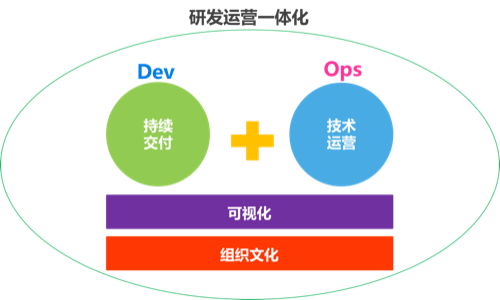

*图 1：DevOps四大能力分布图*

<!-- 诠释一种DevOps的状态-->

### 1. 组织文化
**交付是每个人的事**，DevOps强调团队之间的沟通、协作与尊重，在组织与文化方面，让所有人就目标达成一致，一切都以更快更好地交付有价值的服务为目标。

#### 1.1 跨团队协作

在DevOps模式下，开发、测试、技术运营三种角色需要像一支团队一样紧密地协作。每个迭代都是一个完整的交付周期，迭代内不再仅仅是关注开发和测试，技术运营同样需要考虑在迭代内。根据业务需要，每个迭代结束后都可以发布上线，供用户使用，**Done的定义变成了已发布完成**。

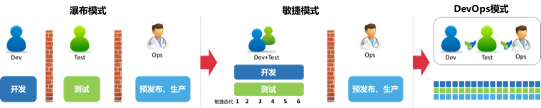

*图 1：不同模式团队协作与交付节奏对比图*

上图中，**每次完整的开发、测试、预发布、生产才算一次发布**，由此可见，在DevOps模式下，发布会更加的频繁，发布的粒度也会更小。

*注：根据Done的定义的变化，迭代看板可以从开发完成、测试完成延伸到发布完成。*

#### 1.2 责任共担
责任共担（Shared Responsibility）是DevOps的核心文化，是团队协作的基石，根本的责任是商业的成功（用户价值的实现）。专业化分工能提升专业能力，但也间接造成了团队的物理隔离，团队目标自然也就逐渐分离。开发团队的目标是以代码实现需求，测试团队的目标是保证软件符合质量要求，技术运营团队的目标是保障线上服务的稳定可用，求变与求稳之间，天然地造成了团队的目标分离，继而责任也就不同，当问题出现时，相互指责随之而来。DevOps强调跨团队协作，开发、测试、技术运营应该作为一个整体看待，打破团队壁垒，大家的核心目标和责任就是交付价值，而不只是关注自己领域的目标。

1. 开发团队需要关注技术运营，主动优化架构、完善日志，增强系统的可运维性
2. 测试团队需要关注功能和技术质量，将测试能力延伸到生产环境，时刻保障服务的功能质量
3. 运维团队需要关注业务目标，主动反馈生产环境信息，积极参与架构设计，简化部署过程

*注：强烈谴责“移交和签收”的协作方式*

#### 1.3 自动化思维

**自动化一切**是DevOps核心思维，开发、测试、技术运营需要一起优化交付过程，自动化构建、自动化部署、自动化测试、自动化运维....在组织文化能力中，自动化不是指使用具体工具实现工作的自动化，而是团队需要具备自动化一切的思维，持续的寻找交付过程中可自动化的工作。

1. 重复性工作，比如：Tomcat安装配置，应用程序部署，编译打包等
2. 复杂性工作，比如：代码技术债务扫描，监控预警，编译打包等

#### 1.4 内建质量
戴明十四条之一：“**停止依靠大规模检查去获得质量**”。业务需要团队更加频繁的部署，更频繁的部署意味着生产环境面临更高的质量风险。继续完全依靠测试团队进行检查的方式会造成测试成为交付的瓶颈，高质量的软件是开发出来，**在开发过程中内建质量**更加重要。开发团队需要完善单元测试以增强对代码的信心，尤其是性能、安全等质量需求需要在开发过程中内建。这也需要测试和技术运营持续的反馈有价值的信息辅助开发团队改进性能和安全质量。

从测试三角形中，我们也能看出，最有价值的测试是单元测试，容易维护、运行速度快、覆盖率高。内建质量从单元测试做起。

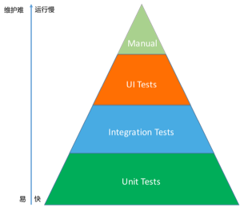

*图 2：测试三角形*

在内建质量文化中，最重要的就是**质量左移**，尽量在开发和集成阶段发现和解决问题。

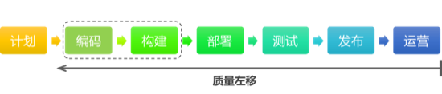

*图 3：质量左移示意图*

#### 1.5 快速反馈

信息需要在人与人之间流通共享，流通需要快速的反馈机制，在DevOps组织文化中，强调团队应该建立快速反馈机制和完善的反馈回路，包括：

1. 快速获取用户对产品的反馈
2. 快速获取交付过程的反馈

完善反馈机制，问题可以得到快速识别和纠正。典型的例子比如：将生产环境的应用程序日志随时提供给开发团队、code review等。敏捷的站立会议、评审会议、回顾会议等也都是快速获取反馈的方式。

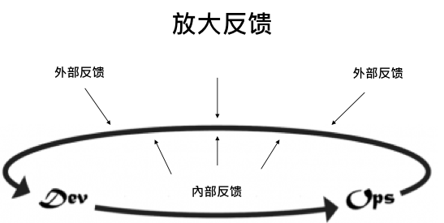

*图 4：快速反馈图*

#### 1.6 持续改进
重复和实践是融会贯通的前提，DevOps文化非常强调持续改进，和产品需要持续优化一样，研发过程和工具实践也都需要持续的改进。需要组织与团队重视改进，主动分配时间进行改进，主动引入故障到系统中，提高系统弹性。持续改进需要依靠数据，全面反映DevOps状态的数据，这也就需要我们建设可视化的能力。

#### 1.7 专业化分工
分工才能带来专业化，组织需要组建专业的技术运营团队，负责建设组织级的技术运营能力，技术运营团队建议配置如下表：

|角色|主要职责|
|---|---|
|业务运维|1. 业务系统与中间件等的审核、部署、维护  2. 全面的应用监控、日志管理、性能分析与优化  3. 应用数据备份管理  4. 突发事件处理  5. 服务高可用保障   6. 协助开发团队，反馈线上数据 |
|基础运维|1. 机房管理：服务器等设备管理维护；机房巡检；与运营商协作  2. 网络规划与实施   3. 机房业务冗余设计  |
|数据库运维|1. DB状态监测、备份检查、恢复验证  2. DB更新  2. 支持开发测试，反馈DB数据|
|安全运维|1.日常安全检查与安全加固   2. 业务系统安全方案制定与实施、整体的信息安全规划   3. 防护设备管理与维护   4. 安全事件应急处理   5. 安全审计和培训 |
|运维开发|1. CMDB平台开发   2. 运维工具的研究、提供与开发，如：Zabbix、Puppet、Linux源、存储系统等   3. 公共服务提供|
|运维管理|1. 运维整体规划     2. 运维团队管理|

**运维组织范例：**

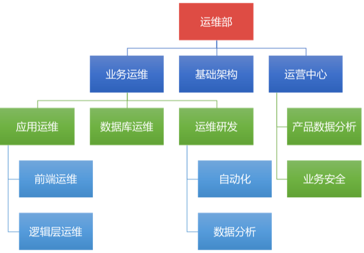

*图 5：腾讯运维组织范例*

**业务运维能力模型参考：**

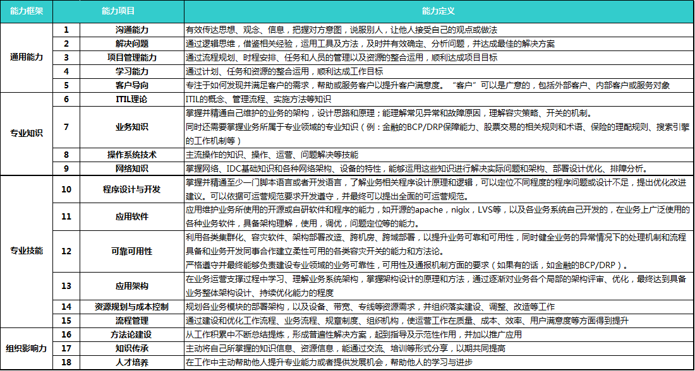

*图 6：腾讯业务运维能力模型参考*

注：

1. 专业技术运营团队建设基于畅捷通运维团队配置、与王津银的交流总结梳理形成
2. 团队应该专注于自己的工作，但视野要全面化，要具有完整的端到端的思维模式，避免局部最优、消除工作孤岛

#### 1.8 DevOps反文化
1. 设置DevOps角色和组织
2. 团队间缺乏协作
3. 互相指责的企业文化
4. 过分依赖个人能力
5. 强调工具，忽略合作
6. 弱化运维

<!-- 

组织文化中待补充：
1. 消除浪费

-->

### 2. 持续交付
持续交付是一种促进团队在短期内开发软件，保证软件可以在任何时间可靠地发布的软件工程方法。持续交付的目标是更快更频繁地构建、测试和发布软件。持续交付通过更加频繁地增量式地更新生产环境来降低变更的成本、时间和风险。简单可重复的部署流程是持续交付的基础，持续交付以全面的版本控制和全面的自动化为核心。简而言之，**持续交付是发布可靠软件的系统方法**。

**持续交付是DevOps能力建设的突破口和基础**，从代码提交到部署上线，持续交付架设起了从开发到技术运营之间的桥梁。

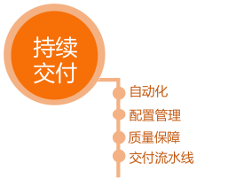

#### 2.1 自动化能力
自动化是持续交付的基础能力，目标是加速代码提交到部署上线的过程，主要包括如下几方面的自动化：构建、环境管理、应用部署、测试。

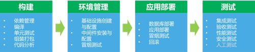

*图 1：自动化能力分布图*

其中，环境管理、应用部署涵盖了持续交付和技术运营两个领域，应该由开发团队和技术运营团队共同建设。

**基于自动化构建和自动化测试能力可以实践持续集成；基于自动化环境管理和和自动化部署可以做持续部署；在持续集成和持续部署的基础上，持续交付水到渠成，团队就可以做到持续地将特性代码发布为在线服务供用户使用。**
<!--
1. 自动化构建
2. 自动化环境配置
	
	中间件包括：
	
	1. 数据库
	2. 缓存
	3. 消息系统
	4. Web服务器
	5. 应用服务器
3. 自动化部署
4. 自动化测试
-->

#### 2.2 配置管理能力
持续交付的源头是配置管理，源代码、依赖、应用、环境都应该实现配置管理。配置管理工具不仅仅是Git、SVN等版本控制工具，Maven的Nexus和自建的CMDB都可视为配置管理工具，只要能够根据版本定位到具体时间点的状态即可。

##### 2.2.1 源代码配置管理
源代码包括：业务代码、测试代码、构建脚本、部署脚本、相关文档等，这些源代码都需要配置管理起来，便于追溯历史版本，和团队成员间的协作。		

##### 2.2.2 依赖管理
依赖管理包括：外部库文件管理和内部组件管理。依赖管理应该采用类似Maven这样的自动化工具实现，而不是将库文件存储到代码库中。团队协作也应该基于组件进行协作，而不是直接依赖于源码。

##### 2.2.3 应用配置管理
应用配置管理主要包括三要素：应用程序、应用程序版本、应用程序版本运行的环境，如JDK\1.7\Ubuntu-Server-14.04-LTS。

##### 2.2.4 环境配置管理
环境配置管理的核心是通过全自动过程创建环境，创建全新的环境总是要比修复已受损的环境更容易。

配置项：

1. 操作系统
	1. 版本
	- 补丁级别
	- 设置
2. 应用依赖的环境软件包
3. 应用需要的网络拓扑结构
4. 应用依赖的外部服务
5. 数据
	
##### 2.2.5 制品配置管理
制品主要是是构建结果，包括.JAR、.WAR等类型的文件，这些构件都是制品成果，用于调用和部署等，制品也需要版本化。可以采用源代码管理的方式使用Git或者SVN来进行管理，或者采用依赖管理的方式使用Nexus进行管理。

#### 2.3 质量保障能力

##### 2.3.1 代码质量能力
代码质量能力是指保证代码的可维护性和安全、性能等非功能需求的能力。团队基于代码进行沟通与协作，高质量的代码对降低潜在风险、提高开发效率意义重大。代码质量能力的关键不是有多少实践和工具，而是**团队对高质量代码达成共识**。
###### 2.3.1.1 技术债务
技术债务（Technical  Debt）：技术债务类似于金融债务，它也会产生利息，这里的利息其实就是指由于鲁莽的设计决策导致需要在未来的开发中付出更多努力的后果。我们可以选择继续支付利息，也可以通过重构之前鲁莽的设计来将本金一次付清。虽然一次性付清本金需要代价，但却可以降低未来的利息。

技术债务最直接的体现是代码的七宗罪：

|类型|英文|影响|
|---|---|---|
|不均匀分布的复杂性|Bad Distribution of Complexity|较高的圈复杂度需要更多的测试才能覆盖到全路径，导致潜在功能质量风险|
|重复代码|Duplications|重复代码是最严重的问题，会导致潜在缺陷，重复也带来维护成本的增加|
|不合适的注释|Not Enough or Too Many Comment|代码的注释率没有明确标准，由团队自己决定，好的代码应该是自描述的|
|违反代码规范|Coding Standards Breach|影响团队基于共同的规范进行协作，增加潜在风险|
|缺乏单元测试|Lack of Unit Tests|单元测试不足会影响团队对代码的信心，增加重构成本，通过测试覆盖率对其进行度量|
|缺陷和潜在的缺陷|Bugs & Potential Bugs| |
|糟糕的设计|Spaghetti Design| |

**管理技术债务**

1. 定义代码质量标准
	
	团队需要就代码质量标准达成一致，包括代码编写规范，复杂度、重复率等指标都需要得到团队的一致认可。
2. 可视化技术债务
	
	可视化技术债务的主要方法是代码扫描，使用自动化代码扫描工具，对技术债务进行扫描，分析出不符合要求的代码并给出改进建议。代码扫描分为静态代码扫描和动态代码扫描。通常使用SonarQube等工具平台对技术债务进行可视化度量，明确技术债务分布情况、债务点以及改进建议等。
3. 偿还技术债务
	
	在团队共识的基础上，可视化技术债务需要团队安排工作量，团队成员共同进行偿还，包括补写白盒测试用例、重构复杂度高的代码、重构重复代码等。重构需要在有足够的自动化测试保障的前提下才能进行。
4. 设置质量门
	
	管理技术债务一方面需要持续偿还旧债，另一方面需要避免引入新债务。设置严格的质量门，限制不合格代码的签入能有效降低技术债务，这就需要持续集成等实践的保障，包括强制的Code Review和结对编程等实践。
	

注：

1. 欠债终归是要还的
2. Martin Fowler的技术债务四象限：

	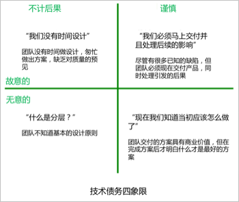
	
	*图 2：技术债务四象限图*

###### 2.3.1.2 安全质量

在互联网时代，安全问题越来越突出，在代码质量能力中，安全能力的建设主要包括安全开发、安全测试、安全扫描。在持续交付领域，重点是完善安全扫描，通过自动化工具对代码进行定期的白盒扫描。同时需要增强提交前扫描，对有问题的代码限制签入。

总结，代码质量需要度量分析来可视化质量问题并驱动团队解决，同时需要将质量内建于开发和构建过程中，通过门禁式签入限制不良代码的签入。代码质量能力的建设核心是团队要有质量意识和共识。

##### 2.3.2 业务质量能力

在持续交付中业务质量能力的三种种保障方式：**内建质量、自动化测试、DTAP多环境质量验证**。内建质量可以依靠测试驱动开发（TDD）等实践将质量管理左移，尽量在开发阶段解决。完善的自动化测试，尤其是单元测试对尽早发现缺陷效果明显，统计显示约70%的缺陷可以在单元测试阶段被发现。DevOps中产品功能是需要以服务的方式交付到用户手中的。DTAP多环境验证，每个环节都进行相应的质量验证，层层把关，保障障最终生产环境的质量。

优秀的代码质量对业务质量保障有也促进作用，比如，重复率高则可能导致缺陷修复不全面；复杂度高则可能导致测试用例覆盖不全面，从而造成业务质量较低。

#### 2.4 交付流水线
基于DTAP（DTAP：Development、Testing、Acceptance/Staging、Production）四个环境的交付流水线过程，其中集成环境主要以提供持续交付工程能力为主。

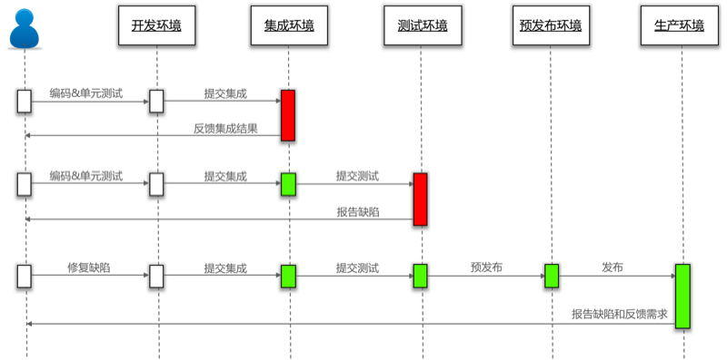

*图 3：基于DTAP的持续交付流水线示意图（参考《持续交付》）*

##### 提交集成

提交集成是指开发人员在开发环境中完成编码和单元测试后，提交代码到代码库中并发起集成的过程，提交集成的目标是将验证之后的开发jy代码提交到代码库主干分支，供其他开发人员使用和提交测试。提交集成会执行**私有构建**，私有构建是可选的，目标是防止明显错误的代码签入代码库，保证代码质量。包括针对该代码库的编译、单元测试、代码扫描和Code Review。其中编译、单元测试和代码扫描的结果可以作为Code Review的依据。
  
##### 提交测试

提交测试是指对产品代码进行集成、部署和功能测试的过程，提交测试的目标是验证新功能是否符合要求并确定待发布的版本。提交测试会执行的过程如下：

1. 集成构建
   
    集成构建的目标是构建出产品部署包，可以是人工触发、定期执行或者提交时即执行。集成构建对产品的所有代码库按顺序进行如下过程：
    1. 编译：生成编译文件，用于打包
    2. 单元测试：生成白盒测试报告，用于衡量产品功能质量
    3. 打包：生成产品部署包，用于部署
    4. 代码扫描：生成产品代码扫描报告，用于衡量产品代码质量，促进团队优化代码
   
2. 自动化部署
   
    自动化部署的目标是运行产品以供测试，基于集成构建的结果在测试环境中部署应用，并执行冒烟测试验证部署是否成功，然后通知测试人员进行测试。
3. 自动化测试

    自动化测试的目标是对验证产品是否符合需求，使用自动化测试工具对产品进行测试，生成自动化测试报告。
4. 人工测试
   
    测试人员在自动化测试的基础上根据业务需求和测试经验进行探索性测试，发现隐藏的缺陷。
5. 制品管理

    在提交测试确认通过后，需要将产品部署包版本化以备发布。

##### 预发布

预发布是指将待发布的产品部署包到预发布环境，并进行验证的过程，包括性能测试、渗透测试、功能探索性测试等，预发布的目标是确定待发布产品部署包是否可以部署到生产环境。在确认可以发布后，需要生成发布说明包括新特性和缺陷修复的信息等。

##### 发布

发布是指将产品部署包部署到生产环境并提供服务的过程。

**详细的持续交付流水线如图所示：**

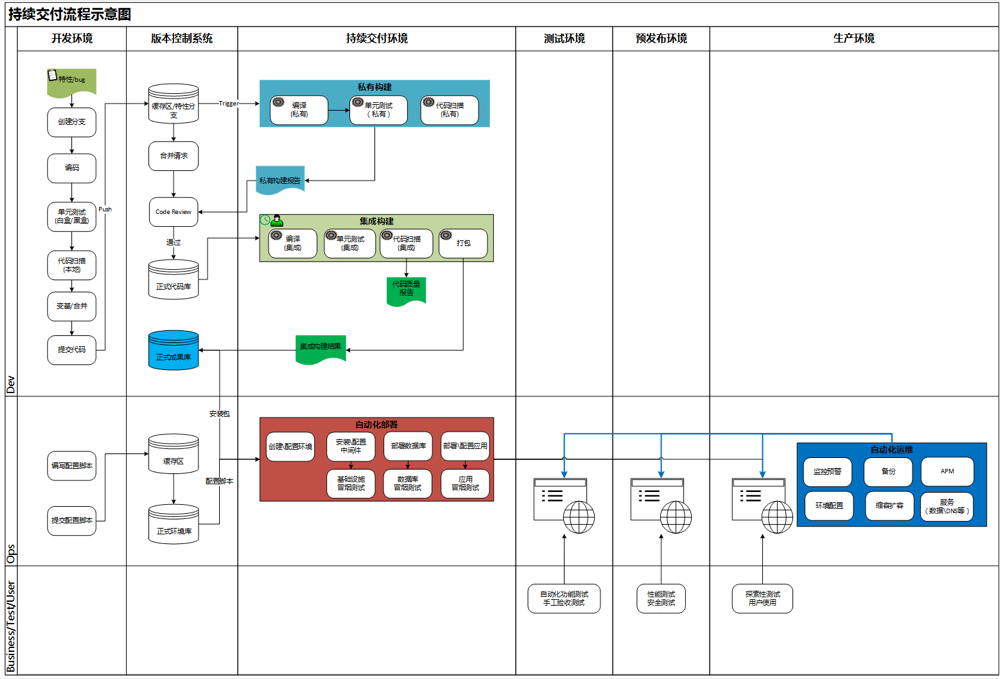

*图 4：持续交付流程图*

### 3. 技术运营

DevOps比持续交付更进一步的地方就在于它开始关注技术运营，并提倡开发团队与技术运营团队之间的有效协作，提倡开发能力、测试能力、持续交付能力、技术运营能力的相互延伸和服务。技术运营对我们而言是相对陌生的领域，基于畅捷通运维部的分享，金山、新浪等互联网公司的交流，运维专家王津银的交流，我们总结技术运营能力如下：

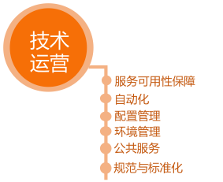

#### 3.1 服务可用性保障能力
SLA（Service-Level Agreement）服务级别协议是指提供服务的企业与客户之间就服务的品质、水准、性能等方面所达成的双方共同认可的协议或契约。即服务可用性状况，是衡量互联网服务技术运营的重要数据。常见的例如阿里云主机的SLA为99.95%，即阿里云主机的可用性大于99.95%，即一周内最多宕机5分钟。
 
保证SLA是技术运营和研发、测试团队共同的长期目标，线上环境复杂多变，尤其外部网络、机房等问题不受团队控制，团队需要建立完善的机制保障SLA，如：故障预案和故障分析、运维规范、运维标准与准入、高可用架构、故障容错、团队协作、持续交付等等。

#### 3.2 自动化能力

线上环境由于规模大、重复操作多、操作复杂度高、操作失误风险大等原因，需要尽量采用自动化的方式进行管理。

1. 自动化服务器提供：包括装机、操作系统网络基础配置等，以便执行后续的自动化配置
2. 自动化配置管理：包括使用自动化配置工具修改操作系统配置、安装配置软件等，CMDB是自动化配置管理的基础
3. 自动化应用部署：技术运营团队需要和研发共建自动化部署能力，以便实现自助化应用部署
4. 自动化业务调度
5. 自动化监控预警：包括硬件状态的监控；操作系统状态监控；应用状态监控；应用性能管理（APM）
6. 自动化安全防护：包括Web漏洞扫描、域名劫持扫描、DDoS攻击扫描、敏感信息扫描等
7. 自动化备份恢复
8. 自动化故障检测与恢复

自动化能力需要基于运维平台实现，并且实现可视化，平台建设的建议：

1. 自底向上，从解决问题入手，逐步建立不同领域的自动化能力，最后实现集成与组装
2. 加强跨团队之间的合作与沟通，在合作的过程中，把彼此的需求都统一到平台中，有利于后续的推广和使用，将研发能力延伸到技术运营也能促进平台的建设
3. 平台建设优先级： 
	高：CMDB、基础架构及服务、数据及服务、监控及服务、持续集成； 
	中：面向业务的运维平台； 
	低：ITIL相关、运维统一门户

#### 3.3 配置管理能力
技术运营的配置管理能力主要体现在CMDB上，CMDB（配置管理数据库）是ITIL的核心，是技术运营的基础平台

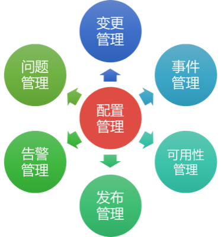

*图 1：CMDB功能，参考王津银《我的互联网运维理论与实践》*

CMDB系统的目标是实现对资源和流程的标准化管理，包括：

1. 建立每个资源的生命周期管理规范、流程规范
2. 实现对资源的拓扑管理
3. 实现对资源的管理

资源：物理资源或者是逻辑资源，即实体机、交换机等物理设备或者虚拟机、应用程序、组件、服务等逻辑资源。

#### 3.4 DTAP环境管理

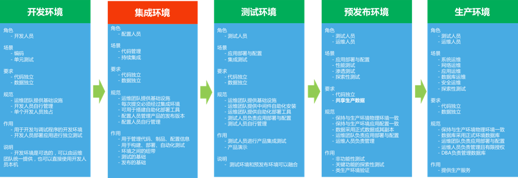

*图 2：DTAP 环境管理图*

##### 开发环境

开发环境的意义在于统一团队的开发环境标准，提高开发效率，降低环境差异。

**开发环境类型：**

1. 开发人员本机
2. 开发人员本机虚拟机或容器
3. 远程服务器（云主机）
4. 在线开发服务

在开发环境中建议安装中间件（数据库、缓存）、版本管理工具、依赖包管理工具、构建工具等，更进一步，建议以云服务的方式简化开发环境，从工具中解决开发团队，让开发团队可以专注在业务开发活动中，常见开发云服务包括：数据库存储服务、缓存服务、文件（图片、文档）存储服务、即时通信（IM）服务等。开发云服务应该由技术运营团队提供，是技术运营团队提供的公共服务能力之一。

##### 集成环境

集成环境是一个工程环境，是持续交付的基础环境，以提供自动化能力为主，集成环境负责驱动代码在四个环境中的流转，最终在生产环境形成服务。
集成环境一般由专业团队负责搭建，需要提供代码托管、自动化构建（编译、单元测试、打包）、自动化部署、自动化测试、制品管理的能力。

##### 测试环境

测试环境的意义在于为验证产品功能和产品演示提供环境，主要服务于测试团队，由持续交付流水线自动化完成环境提供和应用部署，测试专注在功能验证。

##### 预发布环境

预发布环境的意义在于保障生产环境不会轻易被破坏以及进行类生产环境下的非功能测试。类生产环境应该尽量和生产环境保持一致，在蓝绿发布模式下，预发布和生产环境是等价的。

##### 生产环境

生产环境为用户提供服务，只能由授权的运维人员管理，生产环境应该尽量保证稳定，任何变更都需要严格的流程管理，以保证服务的可用性。

注：

1. 为保证构建结果的统一性，集成测试环境、预发布环境、生产环境采用统一的构建结果，不重复构建，构建结果采用版本控制工具存储
2. 任何变更都需要经过每个环境，才能交付用户使用
3. 应用程序必须与环境无依赖，才能保证在DTAP环境中平滑迁移

#### 3.5 公共服务能力
公共服务是指技术运营团队负责管理的自运营服务或第三方云服务，旨在通过公共服务提供业务的响应速度、降低试错成本，支持开发、测试、技术运营团队更快更好地完成工作，常见的公共服务如下：

##### 计算服务
计算服务主要是指使用虚拟化的方式提供CPU和内存的计算能力，如云主机。
##### 存储服务
存储包括：数据库存储、缓存、文件存储等，技术运营团队可以自行搭建标准的数据库、缓存和文件存储系统，如Ceph、FastDFS等，也可以使用云服务，如阿里云存储、七牛云存储等等
##### 统一调度服务
##### 名字服务
名字服务是分布式系统的基础，是核心组件之一，也是衡量分布式系统的标准之一。

**概念：**

1. **服务**：是一个、组、类功能或者接口的业务描述，比如说注册用户、发送短信。转化到技术层面上就会对应一个api或者接口，此时会触发一次远程的RPC调用，函数内的功能不是。
2. **服务实例**：服务实例是服务对应的一组IP和端口的简称。当前端服务需要请求后端某服务的时候，此时需要先找到对应的服务运行实例，也就是进程和端口，然后才能建立connection，从而发起请求。
3. **服务注册**：某个服务实例需要对外提供服务的时候，该服务实例应对外宣告自己能提供的服务有哪些，因此需要向服务中心进行注册，便于调用方能够发现这个服务。
4. **服务发现**：调用方通过某种方式找到被调用方，需要知道服务运行的位置（IP+PORT）。
5. **服务调用**：分为主调服务和被调服务，在一个合理的架构中，服务的调用应该是瀑布结构，即自上而下的顺序调用，而非环形调用。
	
**问题：**

1. 能访问的服务是什么？即服务注册与服务发现。
2. 应用访问的服务是什么？
3. 服务故障是怎么办？

**示意图：**

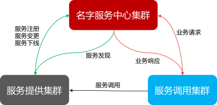

*图 3：名字服务示意图*

**服务调用模式：**

1. 硬编码模式
2. 配置文件模式
3. 类LVS模式
4. DNS模式（经典）
5. 总线模式 
6. 类zookeeper模式
7. 类etcd模式

详情可参见微信公众号【互联网运维杂谈】——【技术篇】细看名字服务中心

##### CDN服务
CDN（Content Delivery Network）即内容分发网络，基本原理是反向代理，目标是实时的根据网络流量和各节点的连接、负载状况以及到用户的距离和响应时间等综合信息**将用户的请求重新导向离用户最近的服务节点上**。使用户就近取得所需资源，解决网络拥挤的状况，提高用户访问网站的响应速度。主流厂商包括北京蓝海汛通，上海帝联，上海网宿等。

##### APM服务
APM（Application Performance Management）即应用性能管理，是以真实用户体验和端到端应用性能管理为核心，实现了自上而下的IT管理新模式。可以对前
端浏览器、网络传输、应用性能、中间件性能、数据库性能进行自动关联与分析，帮助用户识别、定位和解决影响应用系统性能和可用性问题。主流产品包括OneAPM、听云等。

OneAPM定义的应用系统端到端的性能管理图：

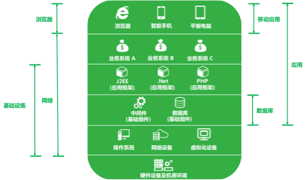

*图 4：OneAPM性能管理分布*

APM典型应用场景：白盒测试、运维监控预警、用户体验管理、业务运营分析。

##### 消息推送服务
无论是Web应用还是移动应用都需要和用户进行交互，消息推送能有针对性的将信息推送给用户，推送的内容包括聊天消息、日程提醒、公告、广告等等。消息推送服务产品包括用友有信、极光推送、个推等。

##### 云测试服务
云测试（Cloud Testing），是基于云计算的一种新型测试方案。服务商提供跨平台、跨浏览器、跨机型的测试平台，用户编写Selenium自动化测试脚本并上传到云测试平台运维，云测试平台也会定义公共的测试。云测试在移动应用测试领域应用的比较多，如：Testin、易测云等。云服务可以有效降低测试成本。
##### 大数据服务

##### DNS服务
##### 负载均衡服务
##### 监控服务
基于开源监控软件Zabbix、Nagios、Cacti以及APM平台，提供全面的监控服务，包括日志管理、监控、预警等，帮助技术运营团队进行运维，同时也为开发者提供有效的生产环境数据，便于开发者持续优化应用。

公共服务有很多，以上列举了常见的服务，技术运营团队应用持续的完善服务，一方面可以简化运维，提高可用性；另一方面可以帮助开发者更快的实现需求。
公共服务的提供方式可以是**在线服务**，也可以是**标准容器镜像**。
在公共服务能力建设方面，技术运营团队需要具备服务运营、推广、指导的能力，倒逼技术架构的优化，这也是运维标准化的一种方式。

#### 3.6 规范与标准化能力

##### 3.6.1 架构规范
架构能力是对整个产品系统进行评估，通过可量化的质量来规范和评估产品系统，不断改进。团队应该定期的组织技术专家依据规范对产品系统进行架构能力的评估。

|架构能力|权重|L1|L2|L3|L4|L5|
|:--|:--|:--|:--|:--|:--|:--|
|容错能力|15|无容错考虑，仅实现业务功能     |所以硬件、软件和数据都被许有备份，数据可为冷备份，支持负载均衡|无单点故障，单台服务器的SLA级别只少大搞L3，对各种异常情况进行自动处理，进行报警和自动恢复|接入层和逻辑层服务器的SLA级别达到L5，可估算主要模块的故障率和影响范围|系统网格化，单台服务器发生故障系统不受影响，所有服务器的SLA级别大搞L5，容一个IDC灾难|
|性能|10|用户请求数处理小于200个/s网络流量<2M |200~500个/s 20~100M|500~1500个/s 100~200M|1500~3000个/s 200~300M|>3000个/s >300M|
|设备空闲率|15|>=20%|>=15%|>=10%|>=5%|<5%|
|IDC分布能力|10|无分布，只能单点接入|电信联通业务流量与QQ用户在电信联通的比例一致，专线使用流量与业务吐出流量比小于1:10|在各大运营商接入，外围IDC流量站业务总流量的30%，专线使用流量与业务吐出流量比小于1:50|外围IDC流量占业务总流量的50%，专线使用流量与业务吐出流量比小于1:100|外围IDC流量占业务总流量的80%，核心数据在两个以上运营商按用户比例分布，专线使用流量与业务吐出流量比小于1:300|
|灰度升级|10|无灰度升级，或者无规划灰度升级|能够基于号码灰度升级（哈希、号段、取模），能够基于号码数量灰度升级，能够基于主要模块灰度升级，具有准确可用的检测手段，以检查升级效果，30分钟内升级失败回滚|能够基于用户来源灰度升级，所有模块均能灰度升级，5分钟内升级失败回滚|真个系统能够纵向灰度升级，新旧并行而互相不干扰|多版本、多系统灰度升级|
|规模伸缩性/扩容|10||通过系统的细微改动可实现系统平滑扩展扩容|可在线平滑扩容，通过调整配置就可以扩容/迁移系统，不需要修改系统代码|
|公共组件的积累和应用|20||参与公共组件的积累工作|积累一定数量的公告组件，在项目中应用公共组件|积累一定数量的优秀组件，能够较好地使用并反馈及完善相关组件|提供优秀组件并有相关推广使用案例|

注：参考《海量运维、运营规划管理之道》

##### 3.6.2 发布规范

**发布类型：**

|发布类型|适用范围|评审人员|
|:--|:--|:--|
|正常版本发布|正常计划版本|测试人员或测试负责人、QA、运营人员、运维人员|
|日常版本发布|包括页面图片、文字、链接、js等小改动|无需评审，邮件周知|
|配置文件|已交由运维人员发布的配置文件|运维人员|
|包发布|后台服务器发布|开发负责人|
|紧急发布|1.修复外网重大BUG 2.紧急需求的发布|1.开发负责人 2.产品负责人、测试负责人、运维人员、运营人员、QA|

**发布过程角色职责：**

|角色|职责|
|:--|:--|
|PM，开发人员|负责发布全流程的正常进行，保证必要信息传递到位，对发布的内容和操作进行全面风险评估，以及对发布质量负责
|产品经理|对发布的功能特性和活动，全面评估和保证用户体验，保证用户体验变更信息及时周知到运营接口人和QA，对发布后的用户反响和用户体验负责
|测试人员|对版本的测试质量负责，是发布评审人员之一，只有确认版本质量无严重问题方可同意发布
|运维人员|作为发布评审人员之一，评估版本变更可能带来的压力或流量，及我们业务系统的承载能力，对容量评估结果负责
|运营接口人|作为发布评审人员之一，保证用户体验变更信息及时通知到运营团队，对特性的用户体验进行把关，对信息通知及时性，准确性负责
|QA|作为发布评审人员之一，保证整个发布过程按规范执行，对规范的执行度负责。

注：参考王津银共享的运维规范，[内网下载链接](http://172.16.50.111/pages/viewpage.action?pageId=34275769)

<!--
##### 标准化
1. 硬件标准化
2. OS标准化
3. 配置标准化
4. 应用包标准化
5. 部署标准化
6. 容器标准化
7. 协议标准化
8. 调度标准化

更多规范与标准请参见附录：《互联网运维规范建议》
-->

#### 3.7 运维平台能力分层体系

运维平台是技术运营能力的体现，是技术运营团队需要持续建设的平台能力，包括对过程、实践、工具的具体实现。技术运营的能力在如下的分层体系中都有体现。

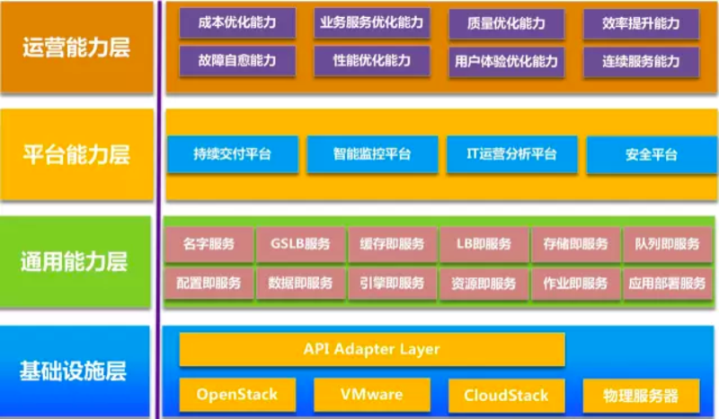

*图 5：运维平台能力分层体系图*

1. 运营能力层
	
	运营能力是技术运营价值的体现，重点是将技术运营能力服务于业务。运营能力依赖的是运维团队的业务理解能力和经验总结。

2. 平台能力层
	
	平台能力是指基于底层平台构建起来的运维自动化、数据化、安全的能力平台，这层能力是面向业务运维场景的，比如说应用交付、持续反馈等。运维平台能力应该是：
	

	1. 集成的，而非离散的
	2. 场景化的，而非基于功能需求的
	3. 基于角色的，而非基于单一用户的
	4. 基于事务，而非基于智能的
3. 通用能力层
	
	通用能力层是基于基础设施之上封装的**公共服务**能力，这层架构的能力分成两部分：一部分是面向业务技术架构的，另一部分是面向运维服务架构的。该层能力是运维服务化的重要实现。

4. 基础设施层
	
	基础设施层是资源交付层，基础设施层应该屏蔽底层基础设施的交付能力，无论是IaaS，还是物理机，都应该通过API向上提供能力。

详情可参见王津银微信公众号【互联网运维杂谈】——【垂直｜运维产品的能力分层体系】

### 4. 可视化能力
可视化能力是独立于组织文化、持续交付、技术运营之外，贯穿始终的一种能力，可视化的意义在于通过数据度量DevOps能力、推动持续改进、便于团队基于全过程的数据分析与协作、帮助定位故障等。建议在阅读本章时对组织文化、持续交付、技术运营都有所了解，因为可视化是建立在业务基础上的。

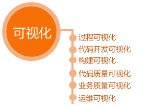

可视化是对现有流程中的数据进行分析、展示，以度量整个过程的状态。度量指标的选择会直接导致组织和团队的行为走向，一定要慎重，**可视化是发现问题、解决问题的手段，而非我们的目标，更不是评价团队和个人的工具**。

DevOps可视化能力的经典数据指标如下：

1. 服务可用性(SLA)
2. 周期时间：从“决定做某种修改”到“该修改结果正式上线”之间的时间
3. 发布频率
4. 发布成功率
5. 故障修复时间

持续交付和技术运营过程中会产生大量的数据，比如日志、代码质量、构建日志等等，我们将这些数据分为三类：**可用性、质量、效率**。以下详细介绍可视化的具体内容：

#### 4.1 代码开发可视化
对代码的开发情况进行度量，可以分析开发人员的提交习惯，了解开发人员的代码贡献情况，结合任务编号还可以统计需求或缺陷影响的代码量，代码开发量应该保持一定的速率。

1. 提交频度
	
	提交本地的一天分布统计，可以看出下午是工作高峰期，如果分布非常不均匀，都集中在下班前，则代码提交规范存在问题，应该更加频繁的提交到本地
	
   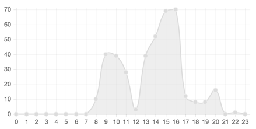  
	*图 1： 团队本地提交的趋势分析图*
   
	提交到远程仓库的日均趋势统计，可以分析出最近一段时间，加班比较频繁，提交分布也不均匀，说明团队可能存在任务拆分不足，提交不规范等问题
	
   
   
   *图 2： 团队远程提交的趋势分析图*
2. 代码量
		
	开发者代码贡献统计，可以分析项目代码贡献情况
	
	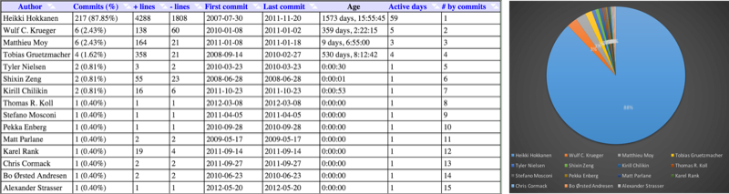
	
	

3. 代码概况
	
	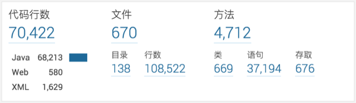
	
	*图 3： 项目代码规模概况*
	
#### 4.2 构建可视化

1. 构建成功率
	
	代码提交后的执行构建，构建的成功率直接反应了代码的质量是否达标，构建成功率也间接反应集成风险大小，构建的成功率可视化可以推动持续改进构建过程和优化代码
2. 构建时长
	
	构建时长直接反应构建粒度是否划分合适，构建过程是否冗余，构建效率是否不足等情况，构建时长统计直接推动进行构建优化。如果产品集成构建时间过长，也意味着后续流程等待的时间较长，无法做到频繁集成。
	构建时长统计也应该细化到各个子过程，如编译时长、自动化测试时长、代码扫描时长、打包时长等，便于有针对性的优化

#### 4.3 代码质量可视化
##### 4.3.1 技术债务
1. 技术债务合计
	
	技术债务应该尽量保持较低的水平，阻断、严重、主要等类型的问题应该尽量保持为0，才能保持技术债务在一个合理的范围
	
	
	
	*图 4： Sonar技术债务总图*
	
2. 技术债务分布情况
	
	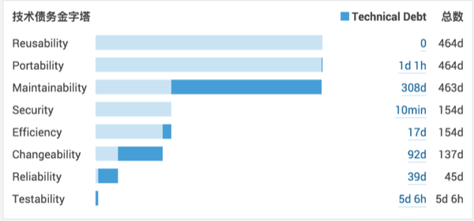	
	*图 5： Sonar技术债务分部图*
	
3. 注释率

	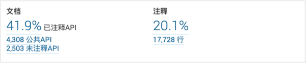	
	*图 6： Sonar注释率图*
	
4. 复杂度
	
	过高的复杂度则意味着需要更多的测试用例才能覆盖到足够的代码执行路径，增加了测试成本，质量风险较高，一般推荐圈复杂度保持在10以内
	
	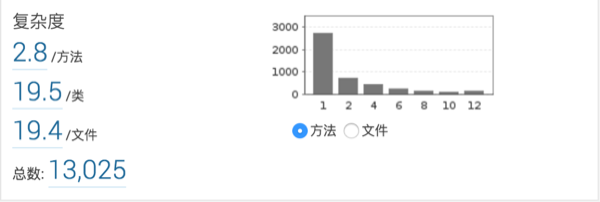
		
	*图 7： Sonar复杂度图*
	
5. 重复率

		
	*图 8： Sonar重复率图*
	
6. 测试覆盖率
	
	代码质量的测试覆盖率主要指单元测试覆盖代码的情况，也叫代码覆盖率。通过测试覆盖率可以基本衡量产品质量，在执行单元测试时会统计测试用例覆盖到的代码行数，从而计算覆盖率，一般建议保持80%以上的测试覆盖率
	
	Line Coverage：100行代码，有95行被测到，就算95%

##### 4.3.2 安全质量

安全扫描结果的可视化可以方便我们及早的发现安全隐患，在开发阶段就进行处理。安全扫描可以借助专业的安全扫描工具，如Fortify，也可以使用SonarQube的安全扫描插件或规则。

1. Fortify 安全扫描摘要

	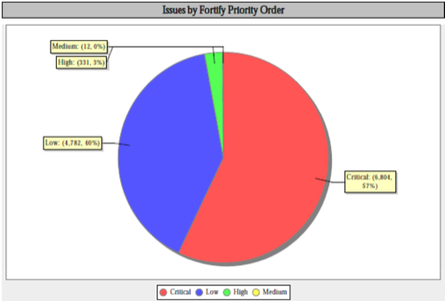
	
	*图 9： Fortify扫描摘要图*
		
2. Fortify 安全扫描问题明细

	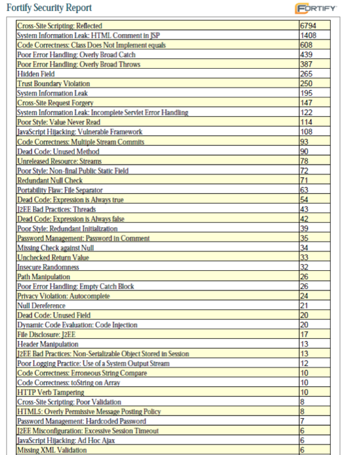

	*图 10： Fortify扫描明细图*
	
*注：示例非实际产品扫描结果*

#### 4.4 业务质量可视化
1. 测试覆盖率	
	测试覆盖率是指测试用例对需求的覆盖情况，根据不同的需求类型，覆盖的要求也不同。如业务逻辑类需求，更加关注基本功能、边界、交互、异常等方面，测试需要覆盖正向路径、替代路径、异常路径。尤其是在TDD模式下，测试覆盖率基本体现了测试完整性和有效性。
	测试覆盖率应该是分阶段，比如单元测试阶段、组件测试阶段、验证测试阶段都应该分析测试覆盖率。一般建议都保持在80%以上。
2. 测试通过率
	
	测试通过率=通过的测试/全部测试用例，用以衡量软件产品在测试过程中的质量，寻找缺陷。
3. 缺陷泄露率
	
	缺陷泄露率=用户发现的缺陷数/（开发+测试环节发现的缺陷数），即鼓励大家在交付之前尽量多做测试来降低缺陷泄漏率。

在组织文化中我们也提到，内建质量才是提高质量的基础，任何依靠检测的手段来提高质量都是治标不治本。

#### 4.5 日志可视化
日志可视化对开发人员分析上线问题、运维人员掌控线上环境都非常重要，可参加DevOps实践集中《畅捷通日志管理实践》

#### 4.6 监控可视化
监控是运维的眼睛，通过监控的可视化我们才能及时发现问题，预防问题，监控的指标项很多:

1. 基础设施状态
	
	常见指标如磁盘使用率趋势、内存使用率趋势、CPU使用率趋势。
	
2. 应用状态
	
	常见指标如用户访问量分析、用户页面加载时间趋势、用户满意度趋势、用户浏览器分析、用户来源地域分析、80端口是否监听、API是否响应、SQL执行时长等等。其中用户来源地域分析对查看网络质量，精准广告投放都有参考价值。
	

	|度量单元|指标项|
	|:--|:--|
	|浏览器|页面加载时间、页面流量、页面开始时间、页面响应时间、浏览器版本号、页面跳转时间、请求重定向时间、本地缓存加载时间、DNS解析时间、TCP传输时间、HTTP请求时间、HTTP响应时间、DOM解析时间、静态资源加载时间、页面性能指数|
	|应用系统|响应时间、吞吐量、性能指数、异常(Java异常、http无响应、web无响应)、代码执行时间|
	|数据库|SQL语句执行计划、SQL语句执行时间、关联的应用事务、SQL 语句的上下文环境、各个环境的时间消耗占比、调用参数|
	|Java虚拟机|堆内存使用情况、非堆内存使用情况、垃圾收集、类装载、线程、会话|
	|服务器|处理器、内存、操作系统、Java虚拟机版本及配置、TPM配置信息|
	|外部服务|平均响应时间、执行时间比重、吞吐量|

4. 线上环境拓扑图
	
	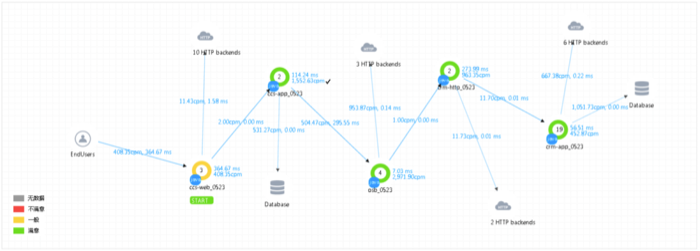
	
	*图 11：OneAPM示例中的拓扑图*

#### 4.7 过程可视化

在持续交付等过程中各个环节都会产生大量的数据，这些数据不仅仅用于可视化具体的构建状态、测试状态，还应该用于可视化整个DevOps过程。从代码提交到发布上线、用户使用的全过程。

1. 交付流水线
	
	通过定义流水线：代码管理、构建(编译、单元测试、打包、代码扫描)、部署、测试、发布上线等过程。对相应环节的工具进行数据分析，可以获取某个特性对应的代码当前出于何种环节，如：构建中、测试中或者已发布。并且可以可视化各个环节的时长，可以重点改进效果明显，优先级高的环节，对持续改进意义很大。
	
	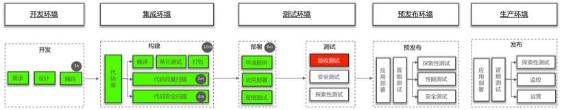
	
	*图 12：过程可视化示意图*	
	
	上图中绿色部分表示已经正常执行通过，以及所消耗的时长，红色部分表示该需求修改的代码在验证测试时没有通过。以此来可视化交付过程。
	
2. 运维过程
	
	与运维事件的过程也可以可视化，如故障处理任务，运维改进任务等等，服务所处的状态等等

在过程可视化方面，可以引入Kanban实践管理交付和运维的过程，团队成员对全国过程一目了然，便于大家协作，同时也给大家提供了端到端的完整视野，便于大家站在整体的角度思考问题。

 

---

#### 上一章：[1. DevOps理解](1_devops_concept.md )　　　　　　　　　　　　　　下一章：[3. DevOps实践](3_devops_practice.md)