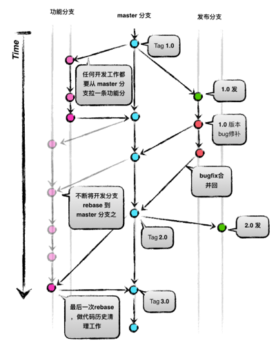
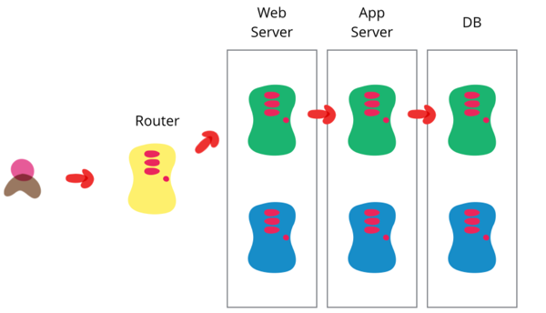

<!--
## 目录

<link rel="stylesheet" href="http://yandex.st/highlightjs/6.2/styles/googlecode.min.css">
 

 

-->

## DevOps实践

DevOps四大能力的建设需要实践与工具进行支撑，结合能力建设的要求，实践主要分布在持续交付和技术运营两大领域，包括持续集成、持续部署、微服务、自动化监控预警、灰度发布等等。本章重点介绍DevOps的实践方法和相应的工具，以帮助大家解决具体的问题。

### 1. 实践分布图

*图 1：DevOps实践分布图*

在交付过程的各个环节中分布着DevOps相关实践，这些实践的目的可以分为：提高速度和提高质量。如自动化构建、自动化部署等都是为了更快交付；单元测试、代码扫描、功能测试等都是为了交付更高质量的代码和服务。除了各个环节的实践以外，还有贯穿整个过程，和文化有关的，比如自组织团队、持续改进等。

### 2. 实践介绍

#### 2.1 代码管理

1. 分布式的工作模式

	1. 编写代码
	2. **提交代码到本地版本库**
	3. 从服务器来回最新代码，解决冲突
	4. **提交代码到本地库**
	5. 将本地代码推送到服务器
	
2. 分支策略
	
	
	
	*图 2：Git工作流图*

**代码管理规范**
	
1. 每个团队成员都频繁提交到主干
2. 使用意义明确的提交注释
	1. 简单的总结性描述（使用fix, add, change等关键字）
	2. 更多的细节
	3. 缺陷与任务系统的链接（UCM）
	
			示例：
			Fix 用户登录失败抛出异常的缺陷

			[Bug #2873942]

			原因分析：用户登录时会调用腾讯的开放用户认证平台，由于网络不稳定造成个别用户登录失败，系统直接抛出程序异常错误，影响用户体验。
			解决办法：在register_from_tencent方法中增加了异常处理，友好提示登录失败；已联系技术运营团队处理网络不稳定问题
		

3. 每次开发新功能都可以新建一个单独的分支
4. 每次提交都应该是原子性的，即每次提交都有业务意义，比如解决一个缺陷，新增一个特性等

#### 2.2 Code Review
	
Code Review对保证代码质量和促进团队学习交流都很有帮助，不建议组织定期的评审会议来进行Code Review，原因如下：
	
1. 无法做法事前控制，有问题的代码已经签入代码库
2. 评审会议中对代码的覆盖率不足，容易漏掉潜在的问题
3. 开发者需要回想需求和代码实现过程，成本高
4. 此时对代码的修改容易引发新问题
	
建议每次提交时都进行强制的Code Review，通过高频率、小粒度的Review更有助于尽早发现问题，促进团队交流协作。
	
Code Review是一种工程实践，更是一种文化，需要团队对代码有较高的质量要求和共识。
#### 2.3 私有构建
私有构建（Private Build）： 持续集成的实践之一，在每次提交代码时执行，目的是尽快发现构建错误，保证代码库的可构建状态（可编译、单元测试通过）以提供集成构建成功率，其构建范围比集成构建小，一般为当前提交分支的代码，要求构建速度快，反馈及时。

*图 3：私有构建示意图*
	
#### 2.4 集成构建
集成构建（Integration Build）：持续集成的实践之一，一种集成类型，定时执行，目的是为了得到可部署和可测试的软件包，可以是每日定时进行，也可以是一段时期，如每个迭代集成一次，其构建结果一般为一个可以独立部署或运行的软件包。

*图 4：集成构建示意图*

#### 2.5 蓝绿发布
蓝绿发布也称热部署，是一种将用户从一个版本几乎瞬间转移到另一个版本的方法，其关键在于将发布流程中的不同部分解耦。蓝绿发布需要两个相同的生产环境版本：蓝环境、绿环境，在蓝绿发布下，预发布环境和生产环境可以互为蓝绿环境。

*图 5：蓝绿发布示意图*

解决数据库切换问题的方法：

1. 是在切换之前暂时将应用程序变成只读状态一段时间，恢复绿数据库到蓝数据库，切换数据库
2. 让应用程序的新版本把数据库事务同时在新旧两个数据库上执行
3. 对应用程序进行设计，让数据库迁移和升级流程独立
		
参考：[Martin Fowler蓝绿部署](http://martinfowler.com/bliki/BlueGreenDeployment.html)

#### 2.6 灰度发布
灰度发布又叫金丝雀发布或A/B测试，是一种测试策略，提升试错能力，减少新版本发布的风险，灰度发布非常容易回滚

*图 6：灰度发布示意图*

1. 将用户按分类引致新版本和旧版本，实现A/B测试
2. 测试对象要具有代表性，需要业务人员参与，尤其是产品运营团队 
3. 实现方式：
	1. 在应用程序中增加特性开关
	2. 运行时配置的改变
	3. 网络规则的调整
4. 逐渐增加负载，检查应用程序的容量表现
5. 重点：任何共享资源要能在生产环境中的所有版本中相互兼容，如缓存、外部服务、数据库等
6. 生产环境的多版本会导致管理的复杂度，应尽量降低金丝雀的数目

参考：[Martin Fowler金丝雀发布](http://martinfowler.com/bliki/CanaryRelease.html)

<!-- A/B测试的具体做法 -->	

#### 2.7 服务可用性运维优化

*图 7：运维优化*

1. 服务降级：在故障发生时，关闭非核心业务，保护核心业务
2. 双中心：双中心同时提供服务，IDC保持无状态，单机房故障时，另一个机房平滑接管业务
3. 统一调度：提供全网、最优、实时、容错的用户访问调度
4. 过载保护：当用户请求超过服务能力时，服务的保护机制，避免雪崩
5. 业务分离：根据服务的重要性等进行服务解耦分离，实现服务的精细化管理，便于实现过载保护、服务降级等
6. 立体化监控：通过建立端到端的数据集成、分析、监控体系，提供故障发现和定位能力

参考：王津银的分享《我的互联网运维理论与实践》

#### 2.8 微服务
**微服务**是一种架构方法，强调将应用拆分成由跨职能团队管理的单目标、松散耦合的多个服务，以提高软件系统交付效率和质量。

微服务与编程语言、平台、操作系统无关。它将庞大的应用拆分成更小更简单的应用，这些庞大的应用一般都是打成一个软件包。每个应用只需要做好一件事，微服务中的“微”就是指服务的功能范围，而不是指代码行数（LOC）少。微服务不仅仅是一种新型的架构模型，也是一直新型的组织模型，微服务在改变交付方式。

**微服务与DevOps相辅相成，微服务意味着更快的交付周期、更适合持续交付的应用架构、更完善的服务监控、更完善的跨职能协作，这些都是DevOps的目标。DevOps的成熟也可以促进微服务的实现，更快的交付方式、更快的故障修复时间都会微服务的交付奠定了基础。
**

##### 微服务关键特点

1. 领域驱动设计：采用Eric Evan的领域驱动设计可以很容易的实现功能的拆分
2. 单一职责原则：每个服务只负责做好功能的一个完整部分即可
3. 显示地发布接口：生产者服务发布的接口一定有对应的消费者服务
4. 独立的DURS：即部署Deploy、更新Update、替换Replace、扩容Scale，每个服务都可以独立的部署、更新、替换和扩容
5. 轻量级通信：服务之间的通信采用基于HTTP的REST、基于WebSocket的STOMP以及其他相似的轻量级协议

##### 微服务的优势

1. 独立扩容
2. 独立升级
3. 易于维护
4. 潜在的异质和多语支持
5. 错误\资源隔离
6. 改进跨团队沟通

##### 微服务的前提条件

1. 服务复制
	
	每个服务都应该可复制，典型的方式是横向克隆和纵向分区。应该有标准的机制使得服务应该可以轻易的基于元数据进行扩容。

2. 服务发现
      
    服务的真正地址需要在服务部署并且可以使用时才会确定。服务终端地址动态特性可以使用服务注册和服务发现来解决。每个服务向代理进行注册并提供详细的信息，包括最终地址。其他的消费者服务查询代理并找出服务的地址并调用它。有很多方法可以注册和查找服务，比如ZooKeeper、etcd、consul、Kubernetes、Netflix Eureka等
      
3. 服务监控

   分布式系统中一个重要的部分就是服务监控和日志管理。这样可以在服务有问题时执行预防措施，比如一个服务访问了未授权的资源等。ELK技术栈可以收集不同服务中日志并且提供可视化展示。其他可以实现分布式日志管理的工具还有Syslog、Logentries和Loggly

4. 容错性

   无论如何进行测试，软件错误总会出现的。在基于多种微服务的分布式系统中容错性更加重要。核心理念不是“如何避免错误”而是“如何处理错误”。微服务自动的采取措施以避免对用户体验造成影响非常重要。断路器模式允许在软件中构建容错性。Netflix的Hystrix和Ribbon都是该模式很好的实现库。

5. DevOps
   
   对基于微服务的应用而言，持续集成和持续部署至关重要。这些实践可以更早识别错误，可以减少在构建不同的服务时不同团队之间的协作成本。

##### 微服务与大型应用架构对比
以电商网站购物车的用户、订单、产品管理为需求背景，对比微服务与大型应用的架构区别，微服务的优势也可以从架构图对比中得到验证

 

##### 微服务架构设计模式

RedHat整理出6种微服务架构设计模式，分别是聚合模式、代理模式、链式模式、分支模式、共享模式、消息模式

常见的聚合模式和消息模式架构图如下：

1. 聚合模式
	将多个微服务聚合成一个组合服务
	
	

2. 消息模式
	
	采用消息系统异步的实现微服务之家的访问
	
	

参考：[开启微服务之旅](attachment/getting-started-with-microservices.pdf)

#### 2.9 12-FACTORS
12-FACTORS是Heroku平台总结SaaS应用开发经验得出的，是开发SaaS应用的实践标准，基于12-FACTORS构建出的SaaS服务的特点：

1. 使用标准化流程自动配置
2. 独立于操作系统，具有很强的可以移植性
3. 适合部署在云计算平台
4. 将开发环境和生产环境的差异降至最低，并使用持续交付实施敏捷开发
5. 可以在工具、架构和开发流程不发生明显变化的前提下实现扩展

##### 1. 代码库
**一个代码库（Codebase），多份部署（deploy）**

12-Factor应用都应该使用版本控制系统加以管理。代码库和应用之间保持一一对应的关系：

* 如果存在多个代码库，就不能称为一个应用，而是一个分布式系统。分布式系统中的每个组件都是一个独立的应用，都可以独立适用12-Factor原则。
* 多个应用共享一个代码库有悖于12-Factor原则，可以将共用代码拆分为独立的类库，以便进行依赖管理

尽管每个应用只对应一个代码库，但可以同时存在多份部署。每份部署相当于运行了一个应用的实例。通常会有一个生产环境，一个或多个预发布环境，一个或多个测试环境。此外，每个开发人员都会在自己本地环境运行一个应用实例，这些都相当于一份部署。
所有部署的代码库相同，但每份部署可以使用其不同的版本。比如，开发人员可能有一些提交还没有同步至预发布环境；预发布环境也有一些提交没有同步至生产环境。但它们都共享一个代码库，我们就认为它们只是相同应用的不同部署而已。

##### 2. 依赖
**显式声明依赖关系（ dependency ）**

大多数编程语言都会提供一个打包系统，用来分发类库，如：Perl的CPAN或是Ruby的Rubygems。通过打包系统安装的类库可以是系统级的（称之为 “site packages”），或仅供某个应用程序使用，部署在相应的目录中（称之为 “vendoring” 或 “bunding”）。

12-Factor规则下的应用程序不会隐式依赖系统级的类库。 它一定通过 依赖清单 ，确切地声明所有依赖项。此外，在运行过程中通过 依赖隔离 工具来确保程序不会调用系统中存在但清单中未声明的依赖项。这一做法会统一应用到生产和开发环境。

显式声明依赖的优点之一是为新进开发者简化了环境配置流程。新进开发者可以检出应用程序的基准代码，安装编程语言环境和它对应的依赖管理工具，只需通过一个 构建命令 来安装所有的依赖项，即可开始工作。

12-Factor 应用同样不会隐式依赖某些系统工具，如curl。即使这些工具存在于几乎所有系统，但终究无法保证所有未来的系统都能支持应用顺利运行，或是能够和应用兼容。如果应用必须使用到某些系统工具，那么这些工具应该被包含在应用之中。

##### 3. 配置
**在环境中存储配置**

通常，应用的配置在不同部署(预发布、生产环境、开发环境等等)间会有很大差异。这其中包括：

* 数据库，Memcached，以及其他后端服务的配置
* 第三方服务的证书
* 每份部署特有的配置，如域名等

有些应用在代码中使用常量保存配置，这与12-Factor所要求的代码和配置严格分离显然背道而驰。配置文件在各部署间存在大幅差异，代码却完全一致。

判断一个应用是否正确地将配置排除在代码之外，一个简单的方法是看该应用的基准代码是否可以立刻开源，而不用担心会暴露任何敏感的信息。

12-Factor推荐将应用的配置存储于 环境变量 中（ env vars, env ）。环境变量可以非常方便地在不同的部署间做修改，却不动一行代码；与配置文件不同，不小心把它们签入代码库的概率微乎其微；与一些传统的解决配置问题的机制（比如 Java 的属性配置文件）相比，环境变量与语言和系统无关。

12-Factor 应用中，环境变量的粒度要足够小，且相对独立。它们永远也不会组合成一个所谓的“环境”，而是独立存在于每个部署之中。当应用程序不断扩展，需要更多种类的部署时，这种配置管理方式能够做到平滑过渡。

##### 4. 后端服务
**把后端服务(backing services)当作附加资源**

后端服务是指程序运行所需要的通过网络调用的各种服务，如数据库（MySQL），消息/队列系统（RabbitMQ），SMTP邮件发送服务（Postfix），以及缓存系统（Memcached）。

12-Factor 应用不会区别对待本地或第三方服务。 对应用程序而言，两种都是附加资源，通过一个url或是其他存储在配置中的服务定位/服务证书来获取数据。12-Factor应用的任意部署，都应该可以在不进行任何代码改动的情况下，将本地MySQL数据库换成第三方服务（例如Amazon RDS）。类似的，本地SMTP服务应该也可以和第三方SMTP服务互换。上述2个例子中，仅需修改配置中的资源地址。

每个不同的后端服务是一份资源。例如，一个MySQL数据库是一个资源，两个MySQL数据库（用来数据分区）就被当作是2个不同的资源。12-Factor应用将这些数据库都视作附加资源，这些资源和它们附属的部署保持松耦合。

部署可以按需加载或卸载资源。例如，如果应用的数据库服务由于硬件问题出现异常，管理员可以从最近的备份中恢复一个数据库，卸载当前的数据库，然后加载新的数据库 – 整个过程都不需要修改代码。

##### 5. 构建，发布，运行
**严格分离构建和运行**

基准代码 转化为一份部署(非开发环境)需要以下三个阶段：

* 构建阶段 是指将代码仓库转化为可执行包的过程。构建时会使用指定版本的代码，获取和打包依赖项，编译成二进制文件和资源文件。
* 发布阶段 会将构建的结果和当前部署所需 配置 相结合，并能够立刻在运行环境中投入使用。
* 运行阶段 （或者说“运行时”）是指针对选定的发布版本，在执行环境中启动一系列应用程序 进程。
代码被构建，然后和配置结合成为发布版本

12-facfor 应用严格区分构建，发布，运行这三个步骤。 举例来说，直接修改处于运行状态的代码是非常不可取的做法，因为这些修改很难再同步回构建步骤。

部署工具通常都提供了发布管理工具，最引人注目的功能是退回至较旧的发布版本。比如， Capistrano 将所有发布版本都存储在一个叫 releases 的子目录中，当前的在线版本只需映射至对应的目录即可。该工具的 rollback 命令可以很容易地实现回退版本的功能。

每一个发布版本必须对应一个唯一的发布 ID，例如可以使用发布时的时间戳（2011-04-06-20:32:17），亦或是一个增长的数字（v100）。发布的版本就像一本只能追加的账本，一旦发布就不可修改，任何的变动都应该产生一个新的发布版本。

新的代码在部署之前，需要开发人员触发构建操作。但是，运行阶段不一定需要人为触发，而是可以自动进行。如服务器重启，或是进程管理器重启了一个崩溃的进程。因此，运行阶段应该保持尽可能少的模块，这样假设半夜发生系统故障而开发人员又捉襟见肘也不会引起太大问题。构建阶段是可以相对复杂一些的，因为错误信息能够立刻展示在开发人员面前，从而得到妥善处理。

##### 6. 进程
**以一个或多个无状态进程运行应用**

##### 7. 端口绑定
**通过端口绑定(Port binding)来提供服务**

##### 8. 并发
**通过进程模型进行扩展**

##### 9. 易处理
**快速启动和优雅终止可最大化健壮性**

##### 10. 开发环境与线上环境等价
**尽可能的保持开发，预发布，线上环境相同**

从以往经验来看，开发环境（即开发人员的本地 部署）和线上环境（外部用户访问的真实部署）之间存在着很多差异。这些差异表现在以下三个方面：

**时间差异**： 开发人员正在编写的代码可能需要几天，几周，甚至几个月才会上线。

**人员差异**： 开发人员编写代码，运维人员部署代码。

**工具差异**： 开发人员或许使用 Nginx，SQLite，OS X，而线上环境使用 Apache，MySQL 以及 Linux。

12-Factor 应用想要做到 持续部署 就必须缩小本地与线上差异。 再回头看上面所描述的三个差异:

缩小时间差异：开发人员可以几小时，甚至几分钟就部署代码。

缩小人员差异：开发人员不只要编写代码，更应该密切参与部署过程以及代码在线上的表现。

缩小工具差异：尽量保证开发环境以及线上环境的一致性。

将上述总结变为一个表格如下：

| |传统应用|12-Factor 应用|
|---|---|---|
|**每次部署间隔**|数周|几小时|
|**开发人员 vs 运维人员**|不同的人|相同的人|
|**开发环境 vs 线上环境**|不同|尽量接近|

后端服务 是保持开发与线上等价的重要部分，例如数据库，队列系统，以及缓存。许多语言都提供了简化获取后端服务的类库，例如不同类型服务的 适配器 。下列表格提供了一些例子。

|类型|语言|类库|适配器|
|---|---|---|---|
|数据库|	Ruby/Rails|ActiveRecord|	MySQL, PostgreSQL, SQLite|
|队列|	Python/Django|Celery|RabbitMQ, Beanstalkd, Redis|
|缓存|	Ruby/Rails|ActiveSupport::Cache|	Memory, filesystem, Memcached|

开发人员有时会觉得在本地环境中使用轻量的后端服务具有很强的吸引力，而那些更重量级的健壮的后端服务应该使用在生产环境。例如，本地使用 SQLite 线上使用 PostgreSQL；又如本地缓存在进程内存中而线上存入 Memcached。

**12-Factor 应用的开发人员应该反对在不同环境间使用不同的后端服务** ，即使适配器已经可以几乎消除使用上的差异。这是因为，不同的后端服务意味着会突然出现的不兼容，从而导致测试、预发布都正常的代码在线上出现问题。这些错误会给持续部署带来阻力。从应用程序的生命周期来看，消除这种阻力需要花费很大的代价。

与此同时，轻量的本地服务也不像以前那样引人注目。借助于Homebrew，apt-get等现代的打包系统，诸如Memcached、PostgreSQL、RabbitMQ 等后端服务的安装与运行也并不复杂。此外，使用类似Chef和Puppet的声明式配置工具，结合像Vagrant这样轻量的虚拟环境就可以使得开发人员的本地环境与线上环境无限接近。与同步环境和持续部署所带来的益处相比，安装这些系统显然是值得的。

不同后端服务的适配器仍然是有用的，因为它们可以使移植后端服务变得简单。但应用的所有部署，这其中包括开发、预发布以及线上环境，都应该使用同一个后端服务的相同版本。

##### 11. 日志
**把日志当作事件流**

##### 12. 管理进程
**后台管理任务当作一次性进程运行**

注：12-Factor应用：按照12-FACTORS要求来设计的应用
原文参考：[http://12factor.net/](http://12factor.net/)

 

---

#### 上一章：[2. DevOps四大能力](2_devops_capability.md )　　　　　　　　　　　　　　下一章：[4. DevOps工具](4_devops_tool.md)