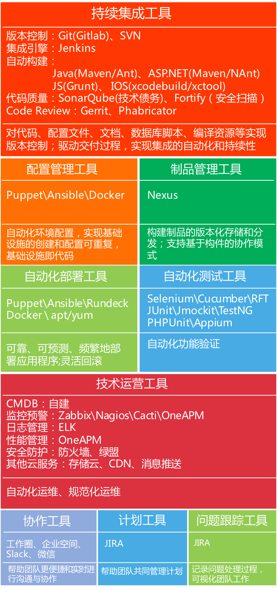
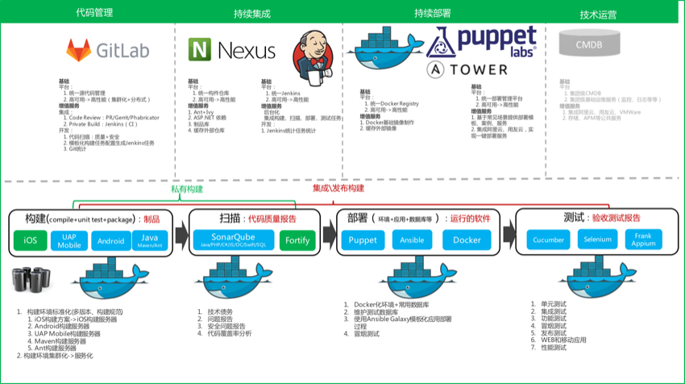

## DevOps工具
工欲善其事必先利其器，DevOps能力最终需要在工具上体现。DevOps涉及领域较多，因此工具也多种多样，我们需要选择适合自己的工具进行使用。集团也在建设YSDP持续交付平台以简化投入，降低工具使用成本，规范交付过程。

### 1. 工具分布图
下图是我们总结出的不同领域的代表性工具，供大家参考。

*图 1：DevOps工具分布图*

### 2. YSDP持续交付平台
YSDP（Yonyou Service Delivery Platform）：用友服务交付平台，YSDP之前专注在开发过程管理，如缺陷、支持网、需求管理等等。随着业务的推进，YSDP从原有的软件开发平台进化为服务交付平台，开始支持代码管理、持续集成、自动化部署等业务，我们希望以服务的方式支撑团队的持续交付业务。

*YSDP持续交付平台服务分布示意图*

#### 2.1 代码管理服务
##### 2.1.1 服务信息
1. **地址**：[http://git.yonyou.com/](http://git.yonyou.com/)
2. 访问方式：内网、外网VPN访问
3. 域账户登录
4. 负责人：赵永昕（zhaoyxh/39707）

##### 2.1.1 服务介绍
我们基于Gitlab社区版本搭建了集团公共的代码管理服务，我们采用了keepalived+drbd等高可用技术、集团专业存储、集团研发管理云平台（UAP云管理平台）作为基础支撑，以保证服务的可用性和稳定性。

代码管理服务主要包含：

1. Git代码托管、Code Review、问题管理（轻量级）、知识管理（MarkDown Wiki）
2. Git培训与使用支持
3. Git分支策略与开发模式支持
4. 代码统计分析
5. Code Review服务：集成Gerrit或Phabricator
6. 镜像优秀开源项目代码
7. 使用持续集成的代码扫描等服务

#### 2.2 持续集成服务
##### 2.2.1 服务信息
1. **地址**：[http://ci.yonyou.com/](http://ci.yonyou.com/)
2. 访问方式：内网、外网VPN访问
3. 域账户登录
4. 负责人：薛文（xuewen/35715）

##### 2.2.2 服务介绍
我们基于Jenkins搭建了集团公共的持续集成服务，我们采用了keepalived+drbd等高可用技术、集团专业存储、集团研发管理云平台（UAP云管理平台）作为基础支撑，以保证服务的可用性和稳定性。希望在集团建设高性能的持续集成服务，减少团队在持续集成方面的投入成本，优化资源配置。除了构建服务，我们还会提供增值服务，如代码质量与代码安全扫描、持续集成改进等，我们会不断提升构建环境的性能、标准化和独立性，让团队获得更好的持续集成服务体验。

持续集成服务主要包括：

1. 持续集成任务调度
2. 持续集成任务定制模板与使用支持
2. Slave构建集群环境提供（Maven\Ant等）
3. Maven培训与使用支持
4. 移动应用集成（Android、iOS、UAP Mobile）
5. 代码质量扫描
6. 代码安全白盒扫描
7. 代码质量综合报告
8. 持续集成方案（私有构建、集成构建）
9. 持续集成改进服务

#### 2.3 制品管理服务
##### 2.3.1 服务信息
1. **地址**：[http://maven.yonyou.com/](http://maven.yonyou.com/)
2. 访问方式：内网、外网VPN访问
3. 域账户登录
4. 负责人：薛文（xuewen/35715）

##### 2.3.2 服务介绍
我们基于Nexus搭建了集团公共的制品管理服务，以支持团队使用Maven作为依赖管理、构建管理工具。Nexus也是基于构件协作的必要条件。

制品管理服务主要包括：

1. 内部构件（依赖文件）的存储服务
2. 外部仓库的缓存服务
3. 持续集成服务直接构建发布制品

#### 2.4 建设中的服务

1. 部署服务
2. 测试服务
3. APM服务
4. ... ...

### 3. 服务共建计划

集团在建设持续交付平台的方式是：第一步，搭建起代码管理、持续集成等基础设施；第二步，发挥社区力量，共建持续交付服务。比如：你认为Docker源码很有价值，可以推荐给我们同步到Git代码管理平台中，方便大家的学习、研究、复用；你的团队在使用Ruby，我们可以一起建设基于RubyGem的打包服务。我们将会持续建设集成阿里云的自动化部署、Docker私服、Docker管理、自动化测试、测试环境提供等一系列服务，欢迎大家参与到我们的服务共建计划共同建设YSDP服务交付平台。

如果你有好的想法，欢迎扫码加微信！

 

---

#### 上一章：[3. DevOps实践](3_devops_practice.md)　　　　　　　　　　　　　　下一章：[5. DevOps社区](5_devops_community.md)