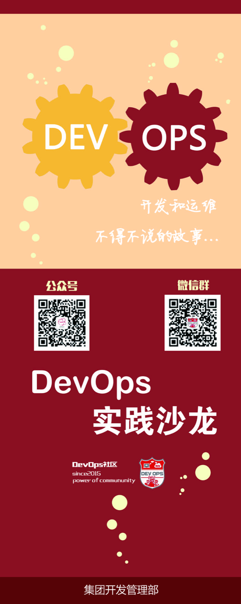

## DevOps社区

用友DevOps社区成立于2015年3月18日，初创成员13人，希望通过发挥社区的群体力量，在用友集团中推进和实践DevOps，提升团队的交付和运营能力。

*图：DevOps社区徽章*

社区为了更好地推进DevOps在集团的落地，发布了两个运营计划和一个沙龙：

### 1. DevOps社区成员招募计划

### 2. DevOps原创文章奖励计划

### 3. DevOps实践沙龙
我们会不定期的组织分享和交流，把内外部的DevOps实践和经验分享给更多的人

### 4. 公众号
社区的活动和文章都会通过公众号进行发布，欢迎大家扫码关注

 

---

#### 上一章：[4. DevOps工具](4_devops_tool.md)　　　　　　　　　　　　　　下一章：[返回目录](README.md)