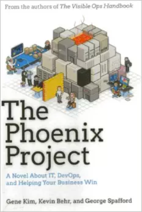
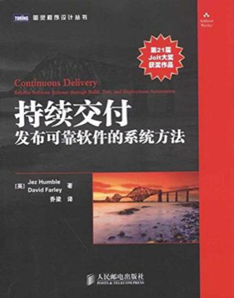
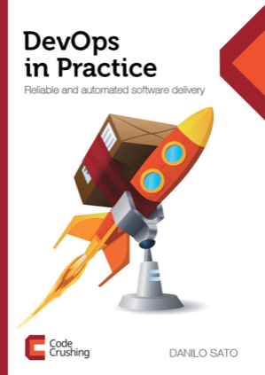

### DevOps推荐书籍

##### 1. The Phoenix Project（凤凰项目）
作者：Gene Kim, Kevin Behr, George Spafford

这本书以小说的形式讲述了一个虚构的故事——如何使用DevOps以解除IT的束缚。故事的主人公叫Bill是一家叫Parts Unlimited的公司的IT经理。奇妙的冒险开始于Bill临危受命担任公司的IT主管。
书中如此描述：

公司的新项目——凤凰项目对Parts Unlimited公司的未来意义重大，但是项目面临中重度的预算超支和延期。公司CEO希望Bill直接向他汇报并在90天内解决当前的困境，否则Bill的整个部门将会面临裁撤，交给外包团队负责。

在一名潜在的董事局成员和他神秘的“The Three Ways”哲学的帮助下，Bill认识到IT工作和制造厂的工作如此的类似。时间一点点过去，Bill必须建立工作制度提高部门内的沟通效率，并高效率地服务公司其他部门的商业需求。

在“欢快”的节奏中，三位DevOps运动的大牛奉献了一个每位IT从业人员都会认为很精彩的故事。读者不仅仅会学会如何提升IT组织的能力，也会对IT有全新的认识。

##### 2. 持续交付-发布可靠软件的系统方法
作者： Jez Humble and David Farley，译者：乔梁

这是一本关于采用工程实践快速且持续地发布新的实用软件给用户的开创性书籍。书的背面描述说“通过实现自动化的构建、部署、测试过程，并改进开发人员、测试人员、运维人员之间的协作，交付团队可以在几小时（甚至几分钟）内发布软件变更，而这不受项目大小和代码复杂性的影响”。

这本书包括自动化的基础设施管理和数据迁移，以及虚拟化的使用，并全面实现构建、集成、测试和发布软件的自动化，包括提示团队的协作能力。

**注：持续交付和DevOps必读之作**
##### 3. DevOps in Practice
作者：DANILO SATO，ThoughtWorks的咨询师

本书以一个完整的电子商务网站作为案例，一步一步实现持续集成、监控预警、自动化部署、自动化环境管理等等，名副其实的实战类技术书籍，里边介绍了Vagrant、Puppet、Nagios、Jenkins、Maven等工具的实际使用，对我们理解整个DevOps很有帮助

