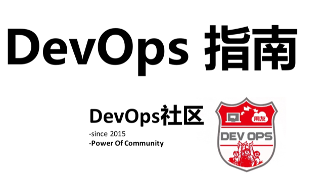
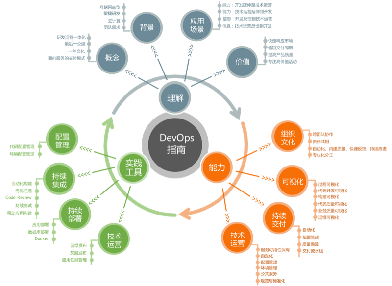

 
 
 

 

 
 
 
 
 
 
 
 

---

# 目录
## 0. [前言]()
　　DevOps指南是DevOps社区基于集团内部实践、外部交流学习总结而成的，旨在阐释DevOps概念和作用，描述DevOps的四项能力，介绍DevOps的具体实践与工具等，作为团队的DevOps参考指南，帮助团队理解和实践DevOps的相关能力。本指南的整体框架如下图所示：
　

　　
　　
## 1. [DevOps理解](1_devops_concept.md)
　　本章会对DevOps进行多角度的诠释，解释DevOps是什么；阐释为什么我们需要DevOps，为什么我们能做DevOps；以及DevOps能给我们带来的具体变化和价值。
## 2. [DevOps四大能力](2_devops_capability.md)
　　本章会对阐述DevOps的四大能力：**组织文化、可视化、持续交付、技术运营**。四项能力会描述一种DevOps的能力状态。大家可以参考四项能力在团队中推进DevOps。

　　**[组织文化](https://git.oschina.net/hongyeli620/devops/blob/master/2_devops_capability.md/?dir=0&filepath=2_devops_capability.md&oid=d4f076890465a1cde53380f7b650573da055dc61&sha=f5cbff9db8fd23d954e9e488548f1154ebc5d910#1-组织文化)**：跨团队协作、责任共担、内建质量、自动化、快速反馈、专业化、持续改进

　　**[可视化](https://git.oschina.net/hongyeli620/devops/blob/master/2_devops_capability.md/?dir=0&filepath=2_devops_capability.md&oid=d4f076890465a1cde53380f7b650573da055dc61&sha=f5cbff9db8fd23d954e9e488548f1154ebc5d910#4-可视化能力)**：过程可视化、代码开发可视化、构建可视化、代码质量可视化、业务质量可视化、运维可视化

　　**[持续交付](https://git.oschina.net/hongyeli620/devops/blob/master/2_devops_capability.md/?dir=0&filepath=2_devops_capability.md&oid=d4f076890465a1cde53380f7b650573da055dc61&sha=f5cbff9db8fd23d954e9e488548f1154ebc5d910#2-持续交付)**：自动化、配置管理、质量保障、交付流水线

　　**[技术运营](https://git.oschina.net/hongyeli620/devops/blob/master/2_devops_capability.md/?dir=0&filepath=2_devops_capability.md&oid=d4f076890465a1cde53380f7b650573da055dc61&sha=f5cbff9db8fd23d954e9e488548f1154ebc5d910#3-技术运营)**：服务可用性、自动化、配置管理、环境管理、公共服务、规范与标准化
## 3. [DevOps实践](3_devops_practice.md)
　　本章会对列举DevOps四大能力相关的具体实践，包括微服务、容器化、自动化扫描、持续集成等等，希望能给大家具体尝试DevOps时提供实践指导和帮助。
## 4. [DevOps工具](4_devops_tool.md)
　　本章会对DevOps相关领域涉及的工具进行列举和说明，希望对大家选择工具时有借鉴意义。
## 5. [DevOps社区](5_devops_community.md)
　　本章会对我们的DevOps社区相关计划与活动进行介绍，希望大家积极的参与到DevOps社区中来，发挥群体智慧，共同进步。
## 6. [附录]()

### &nbsp;&nbsp;&nbsp;&nbsp;&nbsp;6.1 [DevOps案例](6_appendix/6_1_devops_case.md)

### &nbsp;&nbsp;&nbsp;&nbsp;&nbsp;6.2 [DevOps实践集](6_appendix/6_2_devops_practice_set.md)

### &nbsp;&nbsp;&nbsp;&nbsp;&nbsp;6.3 [DevOps推荐阅读清单](6_appendix/6_3_devops_books.md)

<!--
### &nbsp;&nbsp;&nbsp;&nbsp;&nbsp;6.4 [DevOps成熟度模型参考](6_appendix/6_4_devops_maturiy_model.md)
-->

### &nbsp;&nbsp;&nbsp;&nbsp;&nbsp;6.4 [互联网运维建议规范](6_appendix/6_5_devops_internet_op_rules.md)
 
 

---
欢迎大家反馈意见和参与讨论 ，[戳这里](http://git.yonyou.com/devops/devops_guide/issues/1)

##### 内部资料，请勿商用