<!--
## 目录

<link rel="stylesheet" href="http://yandex.st/highlightjs/6.2/styles/googlecode.min.css">
 

 

 
<!--
###Think it,build it,ship it,tweak it.
###思考、构建、交付、调整
-->

## 1. DevOps理解

### 1.1 DevOps概念
#### 1.1.1 研发运营一体化

	   DevOps是一组过程、方法与系统的统称，用于促进开发（应用程序/软件工程）、技术运营和质量保障（QA）部门之间的沟通、协作与整合。
	   它的出现是由于软件行业日益清晰地认识到：为了按时交付软件产品和服务，开发和运营工作必须紧密合作。  --维基百科
	

#### 1.1.2 最后一公里
DevOps核心要解决的是从代码提交到服务发布与运营这个阶段的问题，我们称之为最后一公里，这其中就包括了配置管理、集成、测试、部署、技术运营等领域。

#### 1.1.3 是技术，更是文化
DevOps更多的是一种文化，开发、测试、技术运营紧密合作，为了共同的目标与责任在协作。

1. 责任共担：开发、测试、技术运营，甚至包括产品经理和产品运营应该共同承担产品服务的目标和责任，团队之间不应该有壁垒，各角色的思维不再只是局限于自己的职能。
2. 自动化：DevOps强调自动化一切，这也就要求一切都可以代码化，infrastructure as code 是DevOps中的一个重要实践
3. 内建质量：质量一定不是依靠测试验证来保障和提高的，团队需要引入自动化测试、单元测试、代码审查、代码扫描等实践，在开发过程中建设质量
4. 反馈：DevOps关注不同角色之间的沟通，尤其是生产环境监控是一个很有用的反馈循环，它可以帮助诊断问题和发现潜在改进点

#### 1.1.4 DevOps与持续交付的关系

DevOps比持续交付更进一步，更加强调面向用户，DevOps的目标不再是发布软件包，而是将软件包部署上线，供最终用户使用，并且持续优化线上环境，保证可用性。

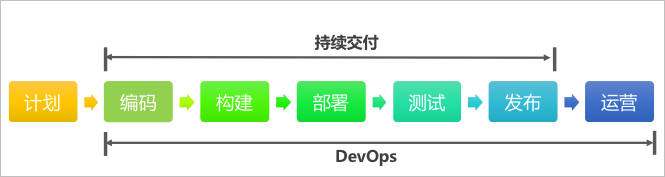

#### 1.1.5 总结
区别于传统软件的交付模式，我们将DevOps总结为：**面向服务的交付模式**

1. 交付内容的变化：从软件产品套件变成有价值的在线服务
2. 交付终点的变化：已发布的可工作的服务才是交付的终点
3. 交付对象的变化：从一线人员（销售、实施）变成了直接用户
4. 交付参与者的变化：从产品、开发、测试变成产品、开发、测试、技术运营

		
### 1.2 背景
<!--为什么要推进DevOps-->

#### 1.2.1 机遇：互联网转型

集团在去年（2014年）吹响了“全面进军企业互联网”的冲锋号，互联网转型迫在眉睫，集团进军企业互联网需要突破现有的软件与解决方案的商业模式，发展在线服务与运营模式。新的商业模式下我们需要新的研发与运营模式来促进软件开发、质量保障、技术运营部门之间的沟通、协作与整合，**更快**、**更好**地完成服务交付，这就是DevOps，一种**面向服务的交付模式**。

<!--技术运营进入到整个价值链中，

互联网在线服务要求我们从以产品为中心转向以客户为中心，从流程驱动转向数据驱动，从延时运行转为实时运行，

统计目前公司的互联网产品，互联网业务创新团队？

云计算服务消费市场

业务对发布时间和质量的要求越来越高

亚马逊发布时间
salesforce发布时间
发布效率的提升

试错理念：极致产品需要尝试，改正，再尝试
-->

#### 1.2.2 基础：敏捷和云计算

1. 敏捷落地

	2012年起，集团全面推进敏捷研发，集团各研发团队大都在采用敏捷研发，Scrum、自动化测试、持续集成等方法与实践得到了普遍应用。敏捷研发提高了团队的效率，团队具备了在研发过程中的快速集成、快速反馈的基本能力。
	
	同时，更短的迭代周期要求更频繁的交付，部署的压力突显，团队需要更高效的完成部署工作。

2. 云计算的普及

	目前市场上有大量的云计算厂商，包括AWS、阿里云（战略合作）、青云、七牛、OneAPM等等，集团内的UAP云管理平台、企业私有云平台也逐渐成熟，云计算大大降低了团队技术运营的门槛、提高了交付上线的效率。云化的趋势越来越明显，团队可以更加快速、可靠、自动化地部署应用程序到云上。
	
	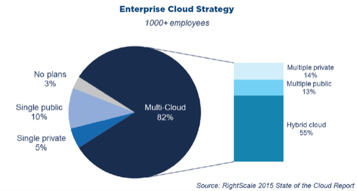
		
#### 1.2.3 期望：团队需求

互联网转型过程中，团队的目标不再是测试通过的软件包，而是在线的服务，需要业务分析、软件开发、质量保障、技术运营、业务运营等角色更紧密的沟通和协作，以便交付安全可靠的服务给用户。传统软件的业务分析、软件开发、质量保障团队和技术运营、业务运营团队之间是存在天然鸿沟的，Dev求新，希望不断的更新；Ops求稳，保障线上稳定是基本职责，而变更是稳定的最大敌人。但是双方目标是一致的，交付有价值的服务给用户，这就需要DevOps提倡的沟通与协作，Ops提供更快更好的交付机制、Dev提供更安全稳定的软件。

集团内已经有很多互联网业务创新团队，技术运营角色已经存在，Dev和Ops的协作是团队面临的基本问题。

### 1.3 应用场景

#### 1.3.1 开发延伸至生产
包括拓展持续集成和发布能力至生产，集成测试和信息安全至整个工作流，确保代码和配置可在生产环境中直接部署

#### 1.3.2 向开发中加入生产反馈

包括建立开发和技术运营任务的完整时间表用于帮助任务的解决，使得开发融入无指责的生产反思，尽可能使得开发可以自助服务，同时创建信息指示器用来表明本地的决策如何影响全局的目标


#### 1.3.3 开发嵌入到技术运营中

包括开发投入到整个生产环境问题处理链中，分配开发资源用于生产问题管理，并协助降低技术债务，而且开发为技术运营提供交叉培训，提高技术运营处理问题的能力，从而降低升级问题的数量

#### 1.3.4 技术运营嵌入到开发中

包括嵌入技术运维资源至开发，帮助开发优化产品架构以提高产品可运维性，帮助开发创建为技术运营(部署、生产代码的管理等)使用的可重用的用户故事，定义一些可以被所有项目共用的非功能性需求，比如开发团队应该按照运维的要求将错误信息输出到日志中，增强可运维性。

### 1.4 价值

#### 1.4.1 技术价值

1. 提高交付频率，以便更快响应市场
2. 降低交付故障率
3. 缩短交付周期
4. 缩短问题平均修复时间
5. 专注创造价值的开发活动
	
	
	
	根据Redhat的报告说明，DevOps能有效缩短部署时间，使得团队可以更加专注于创造价值的活动——开发
	
#### 1.4.2 业务价值

1. 产品快速推向市场，从概念到落地，组织可以快速的将想法变成价值交付到用户手中
2. 提高产品质量，通过自动化手段和技术债务的关注，提高产品功能和代码的双重质量
3. 提高组织效率，通过优化交付流程、自动化交付过程，增加开发时间，提高组织效率

<!--DevOps推进思路，路线图-->

## 2. DevOps四大能力
我们将DevOps总结为**面向服务的交付模式**，这种交付模式重点聚焦**组织文化**、**持续交付**、**技术运营**、**数据可视化**四方面的能力。持续交付覆盖从提交代码到部署到生产环境的全过程，技术运营覆盖生产环境等线上环境的管理过程，数据可视化贯穿服务交付的全过程，组织文化则是促进研发与运维人员协作的基础。

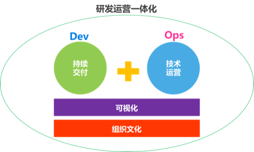

<!-- 诠释一种DevOps的状态-->

### 2.1 组织文化
**交付是每个人的事**，DevOps强调团队之间的沟通与协作，在组织与文化方面，让所有人就目标达成一致，一切都以更快更好地交付有价值的服务为目标。
#### 2.1.1 专业的技术运营团队
分工才能带来专业化，组织需要组建专业的技术运营团队，负责建设组织级的技术运营能力，技术运营团队建议配置如下表：

|角色|主要职责|
|:--|:--|
|业务运维|1. 业务系统与中间件等的审核、部署、维护  2. 全面的应用监控、日志管理、性能分析与优化  3. 应用数据备份管理  4. 突发事件处理  5. 服务高可用保障   6. 协助开发团队，反馈线上数据 |
|基础运维|1. 机房管理：服务器等设备管理维护；机房巡检；与运营商协作  2. 网络规划与实施   3. 机房业务冗余设计  
|数据库运维|1. DB状态监测、备份检查、恢复验证  2. DB更新  2. 支持开发测试，反馈DB数据
|安全运维|1.日常安全检查与安全加固   2. 业务系统安全方案制定与实施、整体的信息安全规划   3. 防护设备管理与维护   4. 安全事件应急处理   5. 安全审计和培训 
|运维开发|1. CMDB平台开发   2. 运维工具的研究、提供与开发，如：Zabbix、Puppet、Linux源、存储系统等   3. 公共服务提供
|运维管理|1. 运维整体规划     2. 运维团队管理|

**运维组织范例：**

**业务运维能力模型参考：**

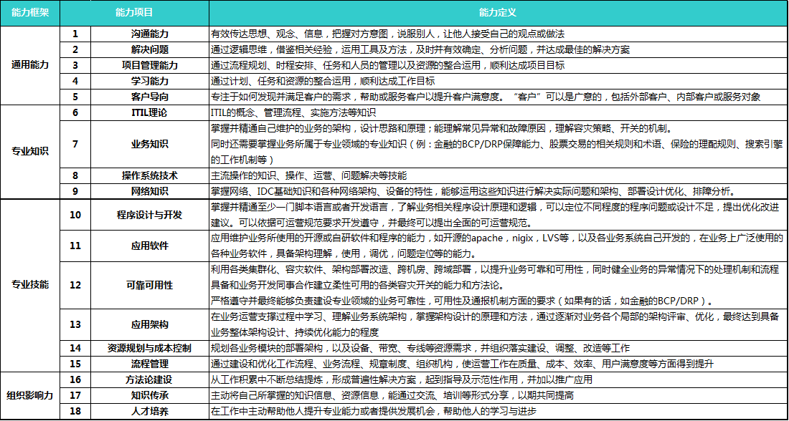

#### 2.1.2 跨团队协作

在DevOps模式下，开发、测试、技术运营三种角色需要像一支团队一样紧密地协作。每个迭代都是一个完整的交付周期，迭代内不再仅仅是关注开发和测试，技术运营同样需要考虑在迭代内。根据业务需要，每个迭代结束后都可以发布上线，供用户使用，**Done的定义变成了已发布完成**。

上图中，每次完成的开发、测试、预发布、生产才算一次发布，由此可见，在DevOps模式下，发布会更加的频繁。

*注：根据Done的定义的变化，迭代看板可以从开发完成、测试完成延伸到发布完成。*

#### 2.1.3 责任共担
责任共担（Shared Responsibility）是DevOps的核心文化，是团队协作的基石，根本的责任是商业的成功（用户价值的实现）。专业化分工能提升专业能力，但也间接造成了团队的物理隔离，团队目标自然也就逐渐分离。开发团队的目标是以代码实现需求，测试团队的目标是保证软件符合质量要求，技术运营团队的目标是保障线上服务的稳定可用，求变与求稳之间，天然地造成了团队的目标分离，继而责任也就不同，当问题出现时，相互指责随之而来。DevOps强调跨团队协作，开发、测试、技术运营应该作为一个整体看待，打破团队壁垒，大家的核心目标和责任就是交付价值，而不只是关注自己领域的目标。

1. 开发团队需要关注技术运营，主动优化架构、完善日志，增强系统的可运维性
2. 测试团队需要关注功能和技术质量，将测试能力延伸到生产环境，时刻保障服务的功能质量
3. 运维团队需要关注业务目标，主动反馈生产环境信息，积极参与架构设计，简化部署过程

*注：强烈谴责“移交和签收”的协作方式*

#### 2.1.4 内建质量
戴明十四条之一：“**停止依靠大规模检查去获得质量**”。业务需要团队更加频繁的部署，更频繁的部署意味着生产环境面临更高的质量风险。继续完全依靠测试团队进行检查的方式会造成测试成为交付的瓶颈，高质量的软件是开发出来，**在开发过程中内建质量**更加重要。开发团队需要完善单元测试以增强对代码的信心，尤其是性能、安全等质量需求需要在开发过程中内建。这也需要测试和技术运营持续的反馈有价值的信息辅助开发团队改进性能和安全质量。

从测试三角形中，我们也能看出，最有价值的测试是单元测试，容易维护、运行速度快、覆盖率高。内建质量从单元测试做起。

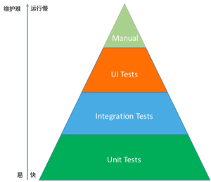

图：测试三角形

#### 2.1.5 自动化思维

**自动化一切**是DevOps核心思维，开发、测试、技术运营需要一起优化交付过程，自动化构建、自动化部署、自动化测试、自动化运维....在组织文化能力中，自动化不是指使用具体工具实现工作的自动化，而是团队需要具备自动化一切的思维，持续的寻找交付过程中可自动化的工作。

1. 重复性工作，比如：Tomcat安装配置，应用程序部署，编译打包等
2. 复杂性工作，比如：代码技术债务扫描，监控预警，编译打包等

#### 2.1.6 持续改进
重复和实践是融会贯通的前提，DevOps文化非常强调持续改进，和产品需要持续优化一样，研发过程和工具实践也都需要持续的改进。需要组织与团队重视改进，主动分配时间进行改进，主动引入故障到系统中，提高系统弹性。

### 2.2 持续交付
持续交付是一种促进团队在短期内开发软件，保证软件可以在任何时间可靠地发布的软件工程方法。持续交付的目标是更快更频繁地构建、测试和发布软件。持续交付通过更加频繁地增量式地更新生产环境来降低变更的成本、时间和风险。简单可重复的部署流程是持续交付的基础，持续交付以全面的版本控制和全面的自动化为核心。简而言之，**持续交付是发布可靠软件的系统方法**。

**持续交付是DevOps能力建设的突破口和基础**，从代码提交到部署上线，持续交付架设起了从开发到技术运营之间的桥梁。

#### 2.2.1 配置管理能力
持续交付的源头是配置管理，源代码、依赖、应用、环境都应该实现配置管理。配置管理工具不仅仅是Git、SVN等版本控制工具，Maven的Nexus和自建的CMDB都可视为配置管理工具，只要能够根据版本定位到具体时间点的状态即可。

##### 2.2.1.1 源代码配置管理
源代码包括：业务代码、测试代码、构建脚本、部署脚本、相关文档等，这些源代码都需要配置管理起来，便于追溯历史版本，和团队成员间的协作。

##### 2.2.1.2 依赖管理
依赖管理包括：外部库文件管理和内部组件管理。依赖管理应该采用类似Maven这样的自动化工具实现，而不是将库文件存储到代码库中。团队协作也应该基于组件进行协作，而不是直接依赖于源码。

##### 2.2.1.3 应用配置管理
应用配置管理主要包括三要素：应用程序、应用程序版本、应用程序版本运行的环境，如JDK\1.7\Ubuntu-Server-14.04-LTS。

##### 2.2.1.4 环境配置管理
环境配置管理的核心是通过全自动过程创建环境，创建全新的环境总是要比修复已受损的环境更容易。

配置项：

1. 操作系统
	* 版本
	* 补丁级别
	* 设置
2. 应用依赖的环境软件包
3. 应用需要的网络拓扑结构
4. 应用依赖的外部服务
5. 数据
	
##### 2.2.1.6 制品配置管理
制品主要是是构建结果，包括.JAR、.WAR等类型的文件，这些构件都是制品成果，用于调用和部署等，制品也需要版本化。可以采用源代码管理的方式使用Git或者SVN来进行管理，或者采用依赖管理的方式使用Nexus进行管理。

#### 2.2.2 自动化能力
自动化是持续交付的基础能力，目标是加速代码提交到部署上线的过程，主要包括如下几方面的自动化：构建、环境管理、应用部署、测试。

其中，环境管理、应用部署涵盖了持续交付和技术运营两个领域，应该由开发团队和技术运营团队共同建设。
<!--
1. 自动化构建
2. 自动化环境配置
	
	中间件包括：
	
	1. 数据库
	2. 缓存
	3. 消息系统
	4. Web服务器
	5. 应用服务器
3. 自动化部署
4. 自动化测试
-->
#### 2.2.3 代码质量能力
代码质量能力是指保证代码的可维护性和安全、性能等非功能需求的能力。团队基于代码进行沟通与协作，高质量的代码对降低潜在风险、提高开发效率意义重大。代码质量能力的关键不是有多少实践和工具，而是**团队对高质量代码达成共识**。
##### 技术债务
技术债务（Technical  Debt）：技术债务类似于金融债务，它也会产生利息，这里的利息其实就是指由于鲁莽的设计决策导致需要在未来的开发中付出更多努力的后果。我们可以选择继续支付利息，也可以通过重构之前鲁莽的设计来将本金一次付清。虽然一次性付清本金需要代价，但却可以降低未来的利息。

技术债务最直接的体现是代码的七宗罪：

|类型|英文|影响|
|:-|
|不均匀分布的复杂性|Bad Distribution of Complexity|较高的圈复杂度需要更多的测试才能覆盖到全路径，导致潜在功能质量风险|
|重复代码|Duplications|重复代码是最严重的问题，会导致潜在缺陷，重复也带来维护成本的增加|
|不合适的注释|Not Enough or Too Many Comment|代码的注释率没有明确标准，由团队自己决定，好的代码应该是自描述的|
|违反代码规范|Coding Standards Breach|影响团队基于共同的规范进行协作，增加潜在风险|
|缺乏单元测试|Lack of Unit Tests|单元测试不足会影响团队对代码的信心，增加重构成本，通过测试覆盖率对其进行度量|
|缺陷和潜在的缺陷|Bugs & Potential Bugs|
|糟糕的设计|Spaghetti Design|

**降低技术债务的方法：**

1. **代码扫描**
	
	使用自动化代码扫描工具，对技术债务进行扫描，分析出不符合要求的代码并给出改进建议。代码扫描分为静态代码扫描和动态代码扫描。
2. **Code Review**
	
	Code Review对保证代码质量和促进团队学习交流都很有帮助，不建议组织定期的评审会议来进行Code Review，原因如下：
	1. 无法做法事前控制，有问题的代码已经签入代码库
	2. 评审会议中对代码的覆盖率不足，容易漏掉潜在的问题
	3. 开发者需要回想需求和代码实现过程，成本高
	4. 此时对代码的修改容易引发新问题
	
	建议每次提交时都进行强制的Code Review，通过高频率、小粒度的Review更有助于尽早发现问题，促进团队交流协作。
	
	Code Review是一种工程实践，更是一种文化，需要团队对代码有较高的质量要求和共识。
	
注：

1. 欠债终归是要还的
2. Martin Fowler的技术债务四象限：

	

##### 安全开发

在互联网时代，安全问题越来越突出，在代码质量能力中，安全能力的建设主要包括安全开发、安全测试、安全扫描。在持续交付领域，重点是完善安全扫描，通过自动化工具对代码进行定期的白盒扫描。

#### 2.2.4 交付流水线
基于DTAP（DTAP：Development、Testing、Acceptance/Staging、Production）四个环境的交付流水线过程，其中集成环境主要以提供持续交付工程能力为主。

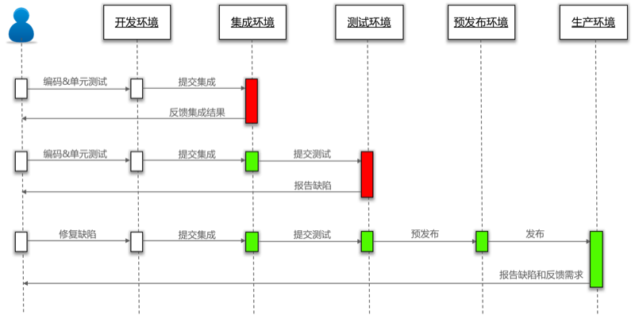

##### 提交集成

提交集成是指开发人员在开发环境中完成编码和单元测试后，提交代码到代码库中并发起集成的过程，提交集成的目标是将验证之后的开发代码提交到代码库主干分支，供其他开发人员使用和提交测试。提交集成会执行**私有构建**，私有构建是可选的，目标是防止明显错误的代码签入代码库，保证代码质量。包括针对该代码库的编译、单元测试、代码扫描和Code Review。其中编译、单元测试和代码扫描的结果可以作为Code Review的依据。
  
##### 提交测试

提交测试是指对产品代码进行集成、部署和功能测试的过程，提交测试的目标是验证新功能是否符合要求并确定待发布的版本。提交测试会执行的过程如下：

1. 集成构建
   
   集成构建的目标是构建出产品部署包，可以是人工触发、定期执行或者提交时即执行。集成构建对产品的所有代码库按顺序进行如下过程：
   1. 编译：生成编译文件，用于打包
   2. 单元测试：生成白盒测试报告，用于衡量产品功能质量
   3. 打包：生成产品部署包，用于部署
   4. 代码扫描：生成产品代码扫描报告，用于衡量产品代码质量，促进团队优化代码
   
2. 自动化部署
   
   自动化部署的目标是运行产品以供测试，基于集成构建的结果在测试环境中部署应用，并执行冒烟测试验证部署是否成功，然后通知测试人员进行测试。
3. 自动化测试

   自动化测试的目标是对验证产品是否符合需求，使用自动化测试工具对产品进行测试，生成自动化测试报告。
4. 人工测试
   
   测试人员在自动化测试的基础上根据业务需求和测试经验进行探索性测试，发现隐藏的缺陷。
5. 制品管理

   在提交测试确认通过后，需要将产品部署包版本化以备发布。

##### 预发布

预发布是指将待发布的产品部署包到预发布环境，并进行验证的过程，包括性能测试、渗透测试、功能探索性测试等，预发布的目标是确定待发布产品部署包是否可以部署到生产环境。在确认可以发布后，需要生成发布说明包括新特性和缺陷修复的信息等。

##### 发布

发布是指将产品部署包部署到生产环境并提供服务的过程。

**详细的持续交付流水线如图所示：**

### 2.3 技术运营

#### 2.3.1 服务可用性保障能力
SLA（Service-Level Agreement）服务级别协议是指提供服务的企业与客户之间就服务的品质、水准、性能等方面所达成的双方共同认可的协议或契约。即服务可用性状况，是衡量互联网服务技术运营的重要数据。常见的例如阿里云主机的SLA为99.95%，即阿里云主机的可用性大于99.95%，即一周内最多宕机5分钟。
 
保证SLA是技术运营和研发、测试团队共同的长期目标，线上环境复杂多变，尤其外部网络、机房等问题不受团队控制，团队需要建立完善的机制保障SLA，如：故障预案和故障分析、运维规范、运维标准与准入、高可用架构、故障容错、团队协作、持续交付等等。

#### 2.3.2 配置管理能力
技术运营的配置管理能力主要体现在CMDB上，CMDB（配置管理数据库）是ITIL的核心，是技术运营的基础平台

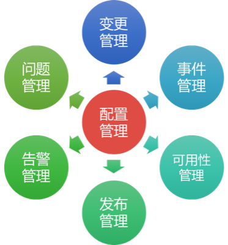

CMDB系统的目标是实现对资源和流程的标准化管理，包括：

1. 建立每个资源的生命周期管理规范、流程规范
2. 实现对资源的拓扑管理
3. 实现对资源的管理

资源：物理资源或者是逻辑资源，即实体机、交换机等物理设备或者虚拟机、应用程序、组件、服务等逻辑资源。

#### 2.3.3 自动化能力

线上环境由于规模大、重复操作多、操作复杂度高、操作失误风险大等原因，需要尽量采用自动化的方式进行管理。

1. 自动化服务器提供：包括装机、操作系统网络基础配置等，以便执行后续的自动化配置
2. 自动化配置管理：包括使用自动化配置工具修改操作系统配置、安装配置软件等，CMDB是自动化配置管理的基础
3. 自动化应用部署：技术运营团队需要和研发共建自动化部署能力，以便实现自助化应用部署
4. 自动化业务调度
5. 自动化监控预警：包括硬件状态的监控；操作系统状态监控；应用状态监控；应用性能管理（APM）
6. 自动化安全防护：包括Web漏洞扫描、域名劫持扫描、DDoS攻击扫描、敏感信息扫描等
7. 自动化备份恢复
8. 自动化故障检测与恢复

自动化能力需要基于运维平台实现，并且实现可视化，平台建设的建议：

1. 自底向上，从解决问题入手，逐步建立不同领域的自动化能力，最后实现集成与组装
2. 加强跨团队之间的合作与沟通，在合作的过程中，把彼此的需求都统一到平台中，有利于后续的推广和使用，将研发能力延伸到技术运营也能促进平台的建设
3. 平台建设优先级： 
	高：CMDB、基础架构及服务、数据及服务、监控及服务、持续集成； 
	中：面向业务的运维平台； 
	低：ITIL相关、运维统一门户

#### 2.3.4 公共服务能力
公共服务是指技术运营团队负责管理的自运营服务或第三方云服务，旨在通过公共服务提供业务的响应速度、降低试错成本，支持开发、测试、技术运营团队更快更好地完成工作，常见的公共服务如下：

##### 计算服务
计算服务主要是指使用虚拟化的方式提供CPU和内存的计算能力，如云主机。
##### 存储服务
存储包括：数据库存储、缓存、文件存储等，技术运营团队可以自行搭建标准的数据库、缓存和文件存储系统，如Ceph、FastDFS等，也可以使用云服务，如阿里云存储、七牛云存储等等
##### 统一调度服务
##### 名字服务
名字服务是分布式系统的基础，是核心组件之一，也是衡量分布式系统的标准之一。

**概念：**

1. **服务**：是一个、组、类功能或者接口的业务描述，比如说注册用户、发送短信。转化到技术层面上就会对应一个api或者接口，此时会触发一次远程的RPC调用，函数内的功能不是。
2. **服务实例**：服务实例是服务对应的一组IP和端口的简称。当前端服务需要请求后端某服务的时候，此时需要先找到对应的服务运行实例，也就是进程和端口，然后才能建立connection，从而发起请求。
3. **服务注册**：某个服务实例需要对外提供服务的时候，该服务实例应对外宣告自己能提供的服务有哪些，因此需要向服务中心进行注册，便于调用方能够发现这个服务。
4. **服务发现**：调用方通过某种方式找到被调用方，需要知道服务运行的位置（IP+PORT）。
5. **服务调用**：分为主调服务和被调服务，在一个合理的架构中，服务的调用应该是瀑布结构，即自上而下的顺序调用，而非环形调用。
	
**问题：**

1. 能访问的服务是什么？即服务注册与服务发现。
2. 应用访问的服务是什么？
3. 服务故障是怎么办？

**示意图：**

**服务调用模式：**

1. 硬编码模式
2. 配置文件模式
3. 类LVS模式
4. DNS模式（经典）
5. 总线模式 
6. 类zookeeper模式
7. 类etcd模式

详情可参见微信公众号【互联网运维杂谈】——【技术篇】细看名字服务中心

##### CDN服务
CDN（Content Delivery Network）即内容分发网络，基本原理是反向代理，目标是实时的根据网络流量和各节点的连接、负载状况以及到用户的距离和响应时间等综合信息**将用户的请求重新导向离用户最近的服务节点上**。使用户就近取得所需资源，解决网络拥挤的状况，提高用户访问网站的响应速度。主流厂商包括北京蓝海汛通，上海帝联，上海网宿等。

##### APM服务
APM（Application Performance Management）即应用性能管理，是以真实用户体验和端到端应用性能管理为核心，实现了自上而下的IT管理新模式。可以对前
端浏览器、网络传输、应用性能、中间件性能、数据库性能进行自动关联与分析，帮助用户识别、定位和解决影响应用系统性能和可用性问题。主流产品包括OneAPM、听云等。

OneAPM定义的应用系统端到端的性能管理图：

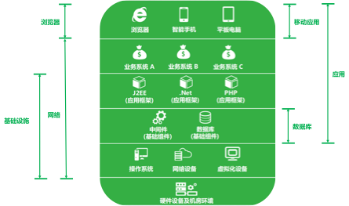

APM典型应用场景：白盒测试、运维监控预警、用户体验管理、业务运营分析。

##### 消息推送服务
无论是Web应用还是移动应用都需要和用户进行交互，消息推送能有针对性的将信息推送给用户，推送的内容包括聊天消息、日程提醒、公告、广告等等。消息推送服务产品包括用友有信、极光推送、个推等。

##### 云测试服务
云测试（Cloud Testing），是基于云计算的一种新型测试方案。服务商提供跨平台、跨浏览器、跨机型的测试平台，用户编写Selenium自动化测试脚本并上传到云测试平台运维，云测试平台也会定义公共的测试。云测试在移动应用测试领域应用的比较多，如：Testin、易测云等。云服务可以有效降低测试成本。
##### 大数据服务

##### DNS服务
##### 负载均衡服务
##### 监控服务
基于开源监控软件Zabbix、Nagios、Cacti以及APM平台，提供全面的监控服务，包括日志管理、监控、预警等，帮助技术运营团队进行运维，同时也为开发者提供有效的生产环境数据，便于开发者持续优化应用。

公共服务有很多，以上列举了常见的服务，技术运营团队应用持续的完善服务，一方面可以简化运维，提高可用性；另一方面可以帮助开发者更快的实现需求。
公共服务的提供方式可以是**在线服务**，也可以是**标准容器镜像**。
在公共服务能力建设方面，技术运营团队需要具备服务运营、推广、指导的能力，倒逼技术架构的优化，这也是运维标准化的一种方式。

#### 2.3.5 规范与标准化能力

##### 架构规范
架构能力是对整个产品系统进行评估，通过可量化的质量来规范和评估产品系统，不断改进。团队应该定期的组织技术专家依据规范对产品系统进行架构能力的评估。

|架构能力|权重|L1|L2|L3|L4|L5|
|:--|:--|:--|:--|:--|:--|:--|
|容错能力|15|无容错考虑，仅实现业务功能     |所以硬件、软件和数据都被许有备份，数据可为冷备份，支持负载均衡|无单点故障，单台服务器的SLA级别只少大搞L3，对各种异常情况进行自动处理，进行报警和自动恢复|接入层和逻辑层服务器的SLA级别达到L5，可估算主要模块的故障率和影响范围|系统网格化，单台服务器发生故障系统不受影响，所有服务器的SLA级别大搞L5，容一个IDC灾难|
|性能|10|用户请求数处理小于200个/s网络流量<2M |200~500个/s 20~100M|500~1500个/s 100~200M|1500~3000个/s 200~300M|>3000个/s >300M|
|设备空闲率|15|>=20%|>=15%|>=10%|>=5%|<5%|
|IDC分布能力|10|无分布，只能单点接入|电信联通业务流量与QQ用户在电信联通的比例一致，专线使用流量与业务吐出流量比小于1:10|在各大运营商接入，外围IDC流量站业务总流量的30%，专线使用流量与业务吐出流量比小于1:50|外围IDC流量占业务总流量的50%，专线使用流量与业务吐出流量比小于1:100|外围IDC流量占业务总流量的80%，核心数据在两个以上运营商按用户比例分布，专线使用流量与业务吐出流量比小于1:300|
|灰度升级|10|无灰度升级，或者无规划灰度升级|能够基于号码灰度升级（哈希、号段、取模），能够基于号码数量灰度升级，能够基于主要模块灰度升级，具有准确可用的检测手段，以检查升级效果，30分钟内升级失败回滚|能够基于用户来源灰度升级，所有模块均能灰度升级，5分钟内升级失败回滚|真个系统能够纵向灰度升级，新旧并行而互相不干扰|多版本、多系统灰度升级|
|规模伸缩性/扩容|10||通过系统的细微改动可实现系统平滑扩展扩容|可在线平滑扩容，通过调整配置就可以扩容/迁移系统，不需要修改系统代码|
|公共组件的积累和应用|20||参与公共组件的积累工作|积累一定数量的公告组件，在项目中应用公共组件|积累一定数量的优秀组件，能够较好地使用并反馈及完善相关组件|提供优秀组件并有相关推广使用案例|

<!--
##### 标准化
1. 硬件标准化
2. OS标准化
3. 配置标准化
4. 应用包标准化
5. 部署标准化
6. 容器标准化
7. 协议标准化
8. 调度标准化

更多规范与标准请参见附录：《互联网运维规范建议》
-->
#### 2.3.6 DTAP环境

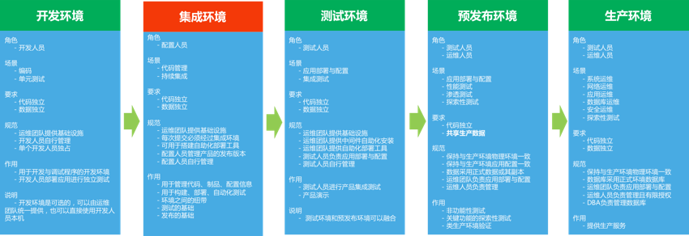

##### 开发环境

开发环境的意义在于统一团队的开发环境标准，提高开发效率，降低环境差异。

**开发环境类型：**

1. 开发人员本机
2. 开发人员本机虚拟机或容器<!--（Vagrant、Docker）-->
3. 远程服务器（云主机）
4. 在线开发服务

在开发环境中建议安装中间件（数据库、缓存）、版本管理工具<!--（Git、SVN等）-->、依赖包管理工具、构建工具<!--（和语言有关Maven、Ant、GEM、PIP）-->等，更进一步，建议以云服务的方式简化开发环境，从工具中解决开发团队，让开发团队可以专注在业务开发活动中，常见开发云服务包括：数据库存储服务、缓存服务、文件（图片、文档）存储服务、即时通信（IM）服务等。开发云服务应该由技术运营团队提供，是技术运营团队提供的公共服务能力之一。

##### 集成环境

集成环境是一个工程环境，是持续交付的基础环境，以提供自动化能力为主，集成环境负责驱动代码在四个环境中的流转，最终在生产环境形成服务。
集成环境一般由专业团队负责搭建，需要提供代码托管、自动化构建（编译、单元测试、打包）、自动化部署、自动化测试、制品管理的能力。

##### 测试环境

测试环境的意义在于为验证产品功能和产品演示提供环境，主要服务于测试团队，由持续交付流水线自动化完成环境提供和应用部署，测试专注在功能验证。

##### 预发布环境

预发布环境的意义在于保障生产环境不会轻易被破坏以及进行类生产环境下的非功能测试。类生产环境应该尽量和生产环境保持一致，在蓝绿发布模式下，预发布和生产环境是等价的。

##### 生产环境

生产环境为用户提供服务，只能由授权的运维人员管理，生产环境应该尽量保证稳定，任何变更都需要严格的流程管理，以保证服务的可用性。

注：

1. 为保证构建结果的统一性，集成测试环境、预发布环境、生产环境采用统一的构建结果，不重复构建，构建结果采用版本控制工具存储
2. 任何变更都需要经过每个环境，才能交付用户使用
3. 应用程序必须与环境无依赖，才能保证在DTAP环境中平滑迁移

#### 2.3.7 发布流程

发布流程参加互联网运维规范建议
<!--
发布类型

|发布类型|适用范围|评审人员|
|:--|:--|:--|
|正常版本发布|正常计划版本|
|日常版本发布|
|配置文件|
|包发布|
|紧急发布|
-->
### 数据可视化能力
数据可视化能力是独立于组织文化、持续交付、技术运营之外，贯穿始终的一种能力，数据可视化的意义在于通过数据度量DevOps能力、推动持续改进、便于团队基于全过程的数据分析与协作、帮助定位故障等。

数据可视化是对现有流程中的数据进行分析、可视化，以度量整个过程的状态。度量指标的选择会直接导致组织和团队的行为走向，一定要慎重，**数据可视化是发现问题、解决问题的手段，而非我们的目标，更不是评价团队和个人的工具**。

DevOps数据可视化能力的经典数据指标如下：

1. 服务可用性(SLA)
2. 周期时间：从“决定做某种修改”到“该修改结果正式上线”之间的时间
3. 发布频率
4. 发布成功率
5. 故障修复时间

持续交付和技术运营过程中会产生大量的数据，比如日志、代码质量、构建日志等等，我们将这些数据分为三类：**可用性、质量、效率**。

#### 代码开发可视化
对代码的开发情况进行度量，可以分析开发人员的提交习惯，了解开发人员的代码贡献情况，结合任务编号还可以统计需求或缺陷影响的代码量，代码开发量应该保持一定的速率。

1. 提交频度
	
	提交本地的一天分布统计，可以看出下午是工作高峰期，如果分布非常不均匀，都集中在下班前，则代码提交规范存在问题，应该更加频繁的提交到本地
	
   	
	提交到远程仓库的日均趋势统计，可以分析出最近一段时间，加班比较频繁，提交分布也不均匀，说明团队可能存在任务拆分不足，提交不规范等问题
	
   

2. 代码量
		
	开发者代码贡献统计，可以分析项目代码贡献情况
	
	
	
	

3. 代码概况
	
	

#### 构建可视化

1. 构建成功率
	
	代码提交后的执行构建，构建的成功率直接反应了代码的质量是否达标，构建成功率也间接反应集成风险大小，构建的成功率可视化可以推动持续改进构建过程和优化代码
2. 构建时长
	
	构建时长直接反应构建粒度是否划分合适，构建过程是否冗余，构建效率是否不足等情况，构建时长统计直接推动进行构建优化。如果产品集成构建时间过长，也意味着后续流程等待的时间较长，无法做到频繁集成。
	构建时长统计也应该细化到各个子过程，如编译时长、自动化测试时长、代码扫描时长、打包时长等，便于有针对性的优化

#### 代码质量可视化
##### 技术债务
1. 技术债务合计
	
	技术债务应该尽量保持较低的水平，阻断、严重、主要等类型的问题应该尽量保持为0，才能保持技术债务在一个合理的范围
	
	
2. 技术债务分布情况
	
	
3. 注释率

	
4. 复杂度
	
	过高的复杂度则意味着需要更多的测试用例才能覆盖到足够的代码执行路径，增加了测试成本，质量风险较高，一般推荐圈复杂度保持在10以内
	
	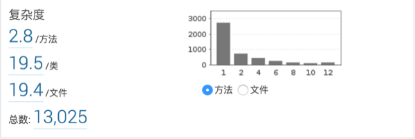
5. 重复率

	
6. 测试覆盖率
	
	代码质量的测试覆盖率主要指单元测试覆盖代码的情况，也叫代码覆盖率。通过测试覆盖率可以基本衡量产品质量，在执行单元测试时会统计测试用例覆盖到的代码行数，从而计算覆盖率，一般建议保持80%以上的测试覆盖率
	
	Line Coverage：100行代码，有95行被测到，就算95%

##### 安全

安全扫描结果的可视化可以方便我们及早的发现安全隐患，在开发阶段就进行处理。安全扫描可以借助专业的安全扫描工具，如Fortify，也可以使用SonarQube的安全扫描插件或规则。

1. Fortify 安全扫描摘要

	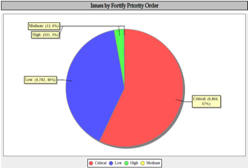
2. Fortify 安全扫描问题明细

	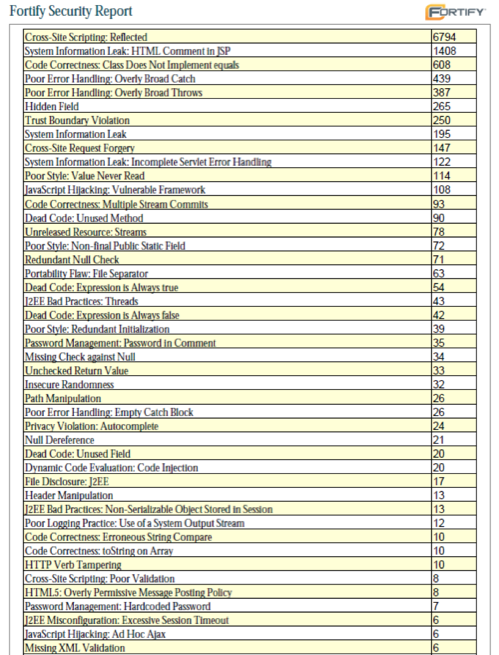

*注：示例非实际产品扫描结果*

#### 业务质量可视化
1. 测试覆盖率	
	测试覆盖率是指测试用例对需求的覆盖情况，根据不同的需求类型，覆盖的要求也不同。如业务逻辑类需求，更加关注基本功能、边界、交互、异常等方面，测试需要覆盖正向路径、替代路径、异常路径。尤其是在TDD模式下，测试覆盖率基本体现了测试完整性和有效性。
	测试覆盖率应该是分阶段，比如单元测试阶段、组件测试阶段、验证测试阶段都应该分析测试覆盖率。一般建议都保持在80%以上。
2. 测试通过率
	
	测试通过率=通过的测试/全部测试用例，用以衡量软件产品在测试过程中的质量，寻找缺陷。
3. 缺陷泄露率
	
	缺陷泄露率=用户发现的缺陷数/（开发+测试环节发现的缺陷数），即鼓励大家在交付之前尽量多做测试来降低缺陷泄漏率。

在组织文化中我们也提到，内建质量才是提高质量的基础，任何依靠检测的手段来提高质量都是治标不治本。

#### 日志可视化
日志可视化对开发人员分析上线问题，运维人员掌控线上环节都非常重要，可参加ELK日志解决方案

#### 监控可视化
监控是运维的眼睛，通过监控的可视化我们才能及时发现问题，预防问题，监控的指标项很多:

1. 基础设施状态
	
	常见指标如磁盘使用率趋势、内存使用率趋势、CPU使用率趋势。
	
2. 应用状态
	
	常见指标如用户访问量分析、用户页面加载时间趋势、用户满意度趋势、用户浏览器分析、用户来源地域分析、80端口是否监听、API是否响应、SQL执行时长等等。其中用户来源地域分析对查看网络质量，精准广告投放都有参考价值。
	

	|度量单元|指标项|
	|:--|:--|
	|浏览器|页面加载时间、页面流量、页面开始时间、页面响应时间、浏览器版本号、页面跳转时间、请求重定向时间、本地缓存加载时间、DNS解析时间、TCP传输时间、HTTP请求时间、HTTP响应时间、DOM解析时间、静态资源加载时间、页面性能指数|
	|应用系统|响应时间、吞吐量、性能指数、异常(Java异常、http无响应、web无响应)、代码执行时间|
	|数据库|SQL语句执行计划、SQL语句执行时间、关联的应用事务、SQL 语句的上下文环境、各个环境的时间消耗占比、调用参数|
	|Java虚拟机|堆内存使用情况、非堆内存使用情况、垃圾收集、类装载、线程、会话|
	|服务器|处理器、内存、操作系统、Java虚拟机版本及配置、TPM配置信息|
	|外部服务|平均响应时间、执行时间比重、吞吐量|

4. 线上环境拓扑图
	
	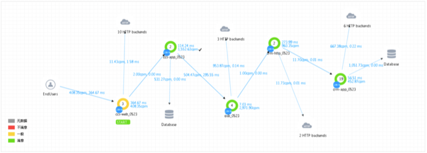
	
	*OneAPM中的拓扑图展示*

	

<!--
#### 作用

1. 推动DevOps持续优化
2. 从关注技术转变成关注业务和用户
 

## 3. DevOps过程

**部署流水线：应用程序从构建、部署、测试到发布整个过程的自动化实现**

目标：

1. 让软件构建、部署、测试和发布过程透明化，促进合作
2. 改善反馈，以便在整个过程中，更早地发现并解决问题
3. 使团队能够通过完全自动化的过程在任意环境上部署和发布软件的任意版本

应用程序的配置、源代码、环境、数据的变更

-->

## DevOps实践
DevOps四大能力的建设需要实践与工具进行支撑，结合能力建设的要求，实践主要分布在持续交付和技术运营两大领域，包括持续集成、持续部署、微服务、自动化监控预警、灰度发布等等。自动化是贯穿DevOps实践的核心。

#### 代码管理
DevOps的切入点是持续交付，持续交付的切入点是代码管理。

**版本化一切**

除了业务代码，还有测试代码、构建脚本、部署脚本、相关文档都需要采用版本控制。

**分布式版本管理**

1. 分布式的工作模式

	1. 编写代码
	2. **提交代码到本地版本库**
	3. 从服务器来回最新代码，解决冲突
	4. **提交代码到本地库**
	5. 将本地代码推送到服务器
	
2. 分支策略
	
	

**代码管理规范**
	
1. 每个团队成员都频繁提交到主干
2. 使用意义明确的提交注释
	1. 简单的总结性描述（使用fix, add, change等关键字）
	2. 更多的细节
	3. 缺陷与任务系统的链接（UCM）
	
			示例：
			Fix 用户登录失败抛出异常的缺陷

			[Bug #2873942]

			原因分析：用户登录时会调用腾讯的开放用户认证平台，由于网络不稳定造成个别用户登录失败，系统直接抛出程序异常错误，影响用户体验。
			解决办法：在register_from_tencent方法中增加了异常处理，友好提示登录失败；已联系技术运营团队处理网络不稳定问题
		

3. 每次开发新功能都可以新建一个单独的分支
4. 每次提交都应该是原子性的，即每次提交都有业务意义，比如解决一个缺陷，新增一个特性等

**分支合并**

#### 持续集成
##### 自动化构建
快速构建
必须构建
修复构建问题优先级最高
构建过程公开透明
##### 自动化扫描
##### 制品管理
##### 代码质量
###### Code Review
通过Gerrit、Gitlab的Merge Request完成

实践要点：

* 构建失败之后不允许提交新代码
* 提交前在本地运行或者持续集成环境中完成所有的提交测试，别名：私有构建、个人构建、提交构建
* 等提交测试通过后再继续工作
* 回家前，构建必须处于成功状态
* 时刻准备回滚到前一个版本
* 在回滚之前要规定一个修复时间
* 不要将失败的测试注释掉
* 为自己导致的问题负责
* 测试驱动开发

#### 持续部署
##### 自动化部署
部署的5Rs
#### 持续测试
##### 自动化测试

#### 重构

##### 云计算
云计算的趋势，使用云服务
多使用云服务就是一种最佳实践

#### 微服务
**微服务**是一种架构方法，强调将应用拆分成由跨职能团队管理的单目标、松散耦合的多个服务，以提高软件系统交付效率和质量。

微服务与编程语言、平台、操作系统无关。它将庞大的应用拆分成更小更简单的应用，这些庞大的应用一般都是打成一个软件包。每个应用只需要做好一件事，微服务中的“微”就是指服务的功能范围，而不是指代码行数（LOC）少。微服务不仅仅是一种新型的架构模型，也是一直新型的组织模型，微服务在改变交付方式。

**微服务与DevOps相辅相成，微服务意味着更快的交付周期、更适合持续交付的应用架构、更完善的服务监控、更完善的跨职能协作，这些都是DevOps的目标。DevOps的成熟也可以促进微服务的实现，更快的交付方式、更快的故障修复时间都会微服务的交付奠定了基础。
**

##### 微服务关键特点

1. 领域驱动设计：采用Eric Evan的领域驱动设计可以很容易的实现功能的拆分
2. 单一职责原则：每个服务只负责做好功能的一个完整部分即可
3. 显示地发布接口：生产者服务发布的接口一定有对应的消费者服务
4. 独立的DURS：即部署Deploy、更新Update、替换Replace、扩容Scale，每个服务都可以独立的部署、更新、替换和扩容
5. 轻量级通信：服务之间的通信采用基于HTTP的REST、基于WebSocket的STOMP以及其他相似的轻量级协议

##### 微服务的优势

1. 独立扩容
2. 独立升级
3. 易于维护
4. 潜在的异质和多语支持
5. 错误\资源隔离
6. 改进跨团队沟通

##### 微服务的前提条件

1. 服务复制
	
	每个服务都应该可复制，典型的方式是横向克隆和纵向分区。应该有标准的机制使得服务应该可以轻易的基于元数据进行扩容。

2. 服务发现
      
    服务的真正地址需要在服务部署并且可以使用时才会确定。服务终端地址动态特性可以使用服务注册和服务发现来解决。每个服务向代理进行注册并提供详细的信息，包括最终地址。其他的消费者服务查询代理并找出服务的地址并调用它。有很多方法可以注册和查找服务，比如ZooKeeper、etcd、consul、Kubernetes、Netflix Eureka等
      
3. 服务监控

   分布式系统中一个重要的部分就是服务监控和日志管理。这样可以在服务有问题时执行预防措施，比如一个服务访问了未授权的资源等。ELK技术栈可以收集不同服务中日志并且提供可视化展示。其他可以实现分布式日志管理的工具还有Syslog、Logentries和Loggly

4. 容错性

   无论如何进行测试，软件错误总会出现的。在基于多种微服务的分布式系统中容错性更加重要。核心理念不是“如何避免错误”而是“如何处理错误”。微服务自动的采取措施以避免对用户体验造成影响非常重要。断路器模式允许在软件中构建容错性。Netflix的Hystrix和Ribbon都是该模式很好的实现库。

5. DevOps
   
   对基于微服务的应用而言，持续集成和持续部署至关重要。这些实践可以更早识别错误，可以减少在构建不同的服务时不同团队之间的协作成本。

##### 微服务与大型应用架构对比
以电商网站购物车的用户、订单、产品管理为需求背景，对比微服务与大型应用的架构区别，微服务的优势也可以从架构图对比中得到验证

 

##### 微服务架构设计模式

RedHat整理出6种微服务架构设计模式，分别是聚合模式、代理模式、链式模式、分支模式、共享模式、消息模式

常见的聚合模式和消息模式架构图如下：

1. 聚合模式
	将多个微服务聚合成一个组合服务
	
	

2. 消息模式
	
	采用消息系统异步的实现微服务之家的访问
	
	

参考：[开启微服务之旅](attachment/getting-started-with-microservices.pdf)

#### 容器技术Docker

Docker的核心理念：Build、Ship、Run，这也是Docker给交付带来的巨大改变的核心——Ship。

#### 零停机发布
##### 蓝绿发布
蓝绿发布也称热部署，是一种将用户从一个版本几乎瞬间转移到另一个版本的方法，其关键在于将发布流程中的不同部分解耦。蓝绿发布需要两个相同的生产环境版本：蓝环境、绿环境，在蓝绿发布下，预发布环境和生产环境可以互为蓝绿环境。

解决数据库切换问题的方法：

1. 是在切换之前暂时将应用程序变成只读状态一段时间，恢复绿数据库到蓝数据库，切换数据库
2. 让应用程序的新版本把数据库事务同时在新旧两个数据库上执行
3. 对应用程序进行设计，让数据库迁移和升级流程独立
		
		
##### 灰度发布
灰度发布又叫金丝雀发布或A/B测试，是一种测试策略，提升试错能力，减少新版本发布的风险，灰度发布非常容易回滚

1. 将用户按分类引致新版本和旧版本，实现A/B测试
2. 测试对象要具有代表性，需要业务人员参与，尤其是产品运营团队 
3. 实现方式：
	1. 在应用程序中增加特性开关
	2. 运行时配置的改变
	3. 网络规则的调整
4. 逐渐增加负载，检查应用程序的容量表现
5. 重点：任何共享资源要能在生产环境中的所有版本中相互兼容，如缓存、外部服务、数据库等
6. 生产环境的多版本会导致管理的复杂度，应尽量降低金丝雀的数目	

#### 服务可用性运维优化

1. 服务降级：在故障发生时，关闭非核心业务，保护核心业务
2. 双中心：双中心同时提供服务，IDC保持无状态，单机房故障时，另一个机房平滑接管业务
3. 统一调度：提供全网、最优、实时、容错的用户访问调度
4. 过载保护：当用户请求超过服务能力时，服务的保护机制，避免雪崩
5. 业务分离：根据服务的重要性等进行服务解耦分离，实现服务的精细化管理，便于实现过载保护、服务降级等
6. 立体化监控：通过建立端到端的数据集成、分析、监控体系，提供故障发现和定位能力		

#### 数据库的持续交付
#### 移动应用构建
#### 建立反馈回路

#### 端到端的应用性能管理

#### SaaS应用开发与运维实践（12-FACTORS）
12-FACTORS是Heroku平台总结SaaS应用开发经验得出的，是开发SaaS应用的实践标准，基于12-FACTORS构建出的SaaS服务的特点：

1. 使用标准化流程自动配置
2. 独立于操作系统，具有很强的可以移植性
3. 适合部署在云计算平台
4. 将开发环境和生产环境的差异降至最低，并使用持续交付实施敏捷开发
5. 可以在工具、架构和开发流程不发生明显变化的前提下实现扩展

##### 1. 代码库
**一个代码库（Codebase），多份部署（deploy）**

12-Factor应用都应该使用版本控制系统加以管理。代码库和应用之间保持一一对应的关系：

* 如果存在多个代码库，就不能称为一个应用，而是一个分布式系统。分布式系统中的每个组件都是一个独立的应用，都可以独立适用12-Factor原则。
* 多个应用共享一个代码库有悖于12-Factor原则，可以将共用代码拆分为独立的类库，以便进行依赖管理

尽管每个应用只对应一个代码库，但可以同时存在多份部署。每份部署相当于运行了一个应用的实例。通常会有一个生产环境，一个或多个预发布环境，一个或多个测试环境。此外，每个开发人员都会在自己本地环境运行一个应用实例，这些都相当于一份部署。
所有部署的代码库相同，但每份部署可以使用其不同的版本。比如，开发人员可能有一些提交还没有同步至预发布环境；预发布环境也有一些提交没有同步至生产环境。但它们都共享一个代码库，我们就认为它们只是相同应用的不同部署而已。

##### 2. 依赖
**显式声明依赖关系（ dependency ）**

大多数编程语言都会提供一个打包系统，用来分发类库，如：Perl的CPAN或是Ruby的Rubygems。通过打包系统安装的类库可以是系统级的（称之为 “site packages”），或仅供某个应用程序使用，部署在相应的目录中（称之为 “vendoring” 或 “bunding”）。

12-Factor规则下的应用程序不会隐式依赖系统级的类库。 它一定通过 依赖清单 ，确切地声明所有依赖项。此外，在运行过程中通过 依赖隔离 工具来确保程序不会调用系统中存在但清单中未声明的依赖项。这一做法会统一应用到生产和开发环境。

显式声明依赖的优点之一是为新进开发者简化了环境配置流程。新进开发者可以检出应用程序的基准代码，安装编程语言环境和它对应的依赖管理工具，只需通过一个 构建命令 来安装所有的依赖项，即可开始工作。

12-Factor 应用同样不会隐式依赖某些系统工具，如curl。即使这些工具存在于几乎所有系统，但终究无法保证所有未来的系统都能支持应用顺利运行，或是能够和应用兼容。如果应用必须使用到某些系统工具，那么这些工具应该被包含在应用之中。

##### 3. 配置
**在环境中存储配置**

通常，应用的配置在不同部署(预发布、生产环境、开发环境等等)间会有很大差异。这其中包括：

* 数据库，Memcached，以及其他后端服务的配置
* 第三方服务的证书
* 每份部署特有的配置，如域名等

有些应用在代码中使用常量保存配置，这与12-Factor所要求的代码和配置严格分离显然背道而驰。配置文件在各部署间存在大幅差异，代码却完全一致。

判断一个应用是否正确地将配置排除在代码之外，一个简单的方法是看该应用的基准代码是否可以立刻开源，而不用担心会暴露任何敏感的信息。

12-Factor推荐将应用的配置存储于 环境变量 中（ env vars, env ）。环境变量可以非常方便地在不同的部署间做修改，却不动一行代码；与配置文件不同，不小心把它们签入代码库的概率微乎其微；与一些传统的解决配置问题的机制（比如 Java 的属性配置文件）相比，环境变量与语言和系统无关。

12-Factor 应用中，环境变量的粒度要足够小，且相对独立。它们永远也不会组合成一个所谓的“环境”，而是独立存在于每个部署之中。当应用程序不断扩展，需要更多种类的部署时，这种配置管理方式能够做到平滑过渡。

##### 4. 后端服务
**把后端服务(backing services)当作附加资源**

后端服务是指程序运行所需要的通过网络调用的各种服务，如数据库（MySQL），消息/队列系统（RabbitMQ），SMTP邮件发送服务（Postfix），以及缓存系统（Memcached）。

12-Factor 应用不会区别对待本地或第三方服务。 对应用程序而言，两种都是附加资源，通过一个url或是其他存储在配置中的服务定位/服务证书来获取数据。12-Factor应用的任意部署，都应该可以在不进行任何代码改动的情况下，将本地MySQL数据库换成第三方服务（例如Amazon RDS）。类似的，本地SMTP服务应该也可以和第三方SMTP服务互换。上述2个例子中，仅需修改配置中的资源地址。

每个不同的后端服务是一份资源。例如，一个MySQL数据库是一个资源，两个MySQL数据库（用来数据分区）就被当作是2个不同的资源。12-Factor应用将这些数据库都视作附加资源，这些资源和它们附属的部署保持松耦合。

部署可以按需加载或卸载资源。例如，如果应用的数据库服务由于硬件问题出现异常，管理员可以从最近的备份中恢复一个数据库，卸载当前的数据库，然后加载新的数据库 – 整个过程都不需要修改代码。

##### 5. 构建，发布，运行
**严格分离构建和运行**

基准代码 转化为一份部署(非开发环境)需要以下三个阶段：

* 构建阶段 是指将代码仓库转化为可执行包的过程。构建时会使用指定版本的代码，获取和打包依赖项，编译成二进制文件和资源文件。
* 发布阶段 会将构建的结果和当前部署所需 配置 相结合，并能够立刻在运行环境中投入使用。
* 运行阶段 （或者说“运行时”）是指针对选定的发布版本，在执行环境中启动一系列应用程序 进程。
代码被构建，然后和配置结合成为发布版本

	

12-facfor 应用严格区分构建，发布，运行这三个步骤。 举例来说，直接修改处于运行状态的代码是非常不可取的做法，因为这些修改很难再同步回构建步骤。

部署工具通常都提供了发布管理工具，最引人注目的功能是退回至较旧的发布版本。比如， Capistrano 将所有发布版本都存储在一个叫 releases 的子目录中，当前的在线版本只需映射至对应的目录即可。该工具的 rollback 命令可以很容易地实现回退版本的功能。

每一个发布版本必须对应一个唯一的发布 ID，例如可以使用发布时的时间戳（2011-04-06-20:32:17），亦或是一个增长的数字（v100）。发布的版本就像一本只能追加的账本，一旦发布就不可修改，任何的变动都应该产生一个新的发布版本。

新的代码在部署之前，需要开发人员触发构建操作。但是，运行阶段不一定需要人为触发，而是可以自动进行。如服务器重启，或是进程管理器重启了一个崩溃的进程。因此，运行阶段应该保持尽可能少的模块，这样假设半夜发生系统故障而开发人员又捉襟见肘也不会引起太大问题。构建阶段是可以相对复杂一些的，因为错误信息能够立刻展示在开发人员面前，从而得到妥善处理。

##### 6. 进程
**以一个或多个无状态进程运行应用**

##### 7. 端口绑定
**通过端口绑定(Port binding)来提供服务**

##### 8. 并发
**通过进程模型进行扩展**

##### 9. 易处理
**快速启动和优雅终止可最大化健壮性**

##### 10. 开发环境与线上环境等价
**尽可能的保持开发，预发布，线上环境相同**

从以往经验来看，开发环境（即开发人员的本地 部署）和线上环境（外部用户访问的真实部署）之间存在着很多差异。这些差异表现在以下三个方面：

**时间差异**： 开发人员正在编写的代码可能需要几天，几周，甚至几个月才会上线。

**人员差异**： 开发人员编写代码，运维人员部署代码。

**工具差异**： 开发人员或许使用 Nginx，SQLite，OS X，而线上环境使用 Apache，MySQL 以及 Linux。

12-Factor 应用想要做到 持续部署 就必须缩小本地与线上差异。 再回头看上面所描述的三个差异:

缩小时间差异：开发人员可以几小时，甚至几分钟就部署代码。

缩小人员差异：开发人员不只要编写代码，更应该密切参与部署过程以及代码在线上的表现。

缩小工具差异：尽量保证开发环境以及线上环境的一致性。

将上述总结变为一个表格如下：

| |传统应用|12-Factor 应用|
|:--|
|**每次部署间隔**|数周|几小时|
|**开发人员 vs 运维人员**|不同的人|相同的人|
|**开发环境 vs 线上环境**|不同|尽量接近|

后端服务 是保持开发与线上等价的重要部分，例如数据库，队列系统，以及缓存。许多语言都提供了简化获取后端服务的类库，例如不同类型服务的 适配器 。下列表格提供了一些例子。

|类型|语言|类库|适配器|
|:--|
|数据库|	Ruby/Rails|ActiveRecord|	MySQL, PostgreSQL, SQLite|
|队列|	Python/Django|Celery|RabbitMQ, Beanstalkd, Redis|
|缓存|	Ruby/Rails|ActiveSupport::Cache|	Memory, filesystem, Memcached|

开发人员有时会觉得在本地环境中使用轻量的后端服务具有很强的吸引力，而那些更重量级的健壮的后端服务应该使用在生产环境。例如，本地使用 SQLite 线上使用 PostgreSQL；又如本地缓存在进程内存中而线上存入 Memcached。

**12-Factor 应用的开发人员应该反对在不同环境间使用不同的后端服务** ，即使适配器已经可以几乎消除使用上的差异。这是因为，不同的后端服务意味着会突然出现的不兼容，从而导致测试、预发布都正常的代码在线上出现问题。这些错误会给持续部署带来阻力。从应用程序的生命周期来看，消除这种阻力需要花费很大的代价。

与此同时，轻量的本地服务也不像以前那样引人注目。借助于Homebrew，apt-get等现代的打包系统，诸如Memcached、PostgreSQL、RabbitMQ 等后端服务的安装与运行也并不复杂。此外，使用类似Chef和Puppet的声明式配置工具，结合像Vagrant这样轻量的虚拟环境就可以使得开发人员的本地环境与线上环境无限接近。与同步环境和持续部署所带来的益处相比，安装这些系统显然是值得的。

不同后端服务的适配器仍然是有用的，因为它们可以使移植后端服务变得简单。但应用的所有部署，这其中包括开发、预发布以及线上环境，都应该使用同一个后端服务的相同版本。

##### 11. 日志
**把日志当作事件流**

#####12. 管理进程
**后台管理任务当作一次性进程运行**

注：12-Factor应用：按照12-FACTORS要求来设计的应用
原文参考：[http://12factor.net/](http://12factor.net/)
<!--

#####1. 环境创建
创建VM、网络、存储、负载均衡、配置VM

#####2. 软件安装和配置

1. 特点：变动不频繁	
2. 内容：	
	操作系统配置（创建用户组，配置参数）	
	基础软件安装和配置（mysql／nginx）	
3. 工具：chef/puppet
	

#####3. 应用部署和配置

1. 特点：变动频繁
2. 内容：部署应用代码（war包，sql，代码）
3. 工具：Fabric/Glu
4. 注意：服务发现和编排很重要

#####4. 监控和告警

OS级别
应用级别

#####5. 故障检测和恢复

注：Design By Failure

#####6. 扩容和缩容

自动伸缩
-->

## DevOps工具
工欲善其事必先利其器，DevOps能力最终需要在工具上体现。DevOps涉及领域较多，因此工具也多种多种，我们需要选择适合自己的工具进行使用。

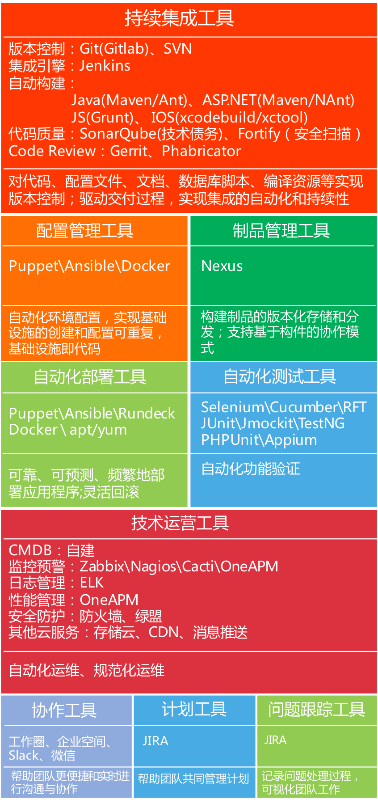

<!--

###DevOps目标
	
打造可靠的、可重复的、完全自动化的服务交付流水线

推动DevOps的主要方式：识别利益冲突并且创造开发与技术运营团队协作的环境

成熟度模型

|层级|运维|部署| 测试 |
|:---|:---|:---|:---|
||||自动化验收测试、手工探索性测试、非功能性测试|
|2层|自动化环境配置||部署的冒烟测试|
||生产环境独立||单元测试|

先做该做的事，再考虑怎么把事做的更好更快，比如自动化
-->

<!--
## DevOps社区

## 附录

### [DevOps案例](devops_case.md)

### [DevOps实践集](devops_practice_set.md)

### DevOps推荐书籍

### OWASP Top10 2013

1. **Injection（注入）**：注入攻击，常见的包括：SQL注入、OS注入、LDAP注入。注入攻击一般发生在不可信数据作为命令或者查询的一部分发送给了解释程序，攻击者的恶意数据可以欺骗解释程序去执行计划外的命令或者访问未经授权的数据。
2. **Broken Authentication and Session Management（失效的身份认证和会话管理）**：与身份认证和会话管理相关的应用程序功能往往实现的不正确，这就导致攻击者危及密码、密钥、会话令牌或者利用其他缺陷冒充其他用户的身份。
3. **Cross-Site Scripting(XSS)（跨站脚本攻击）**：当应用程序收到不可信数据，在没有进行适当的验证和转义的情况下，就将数据发给网页浏览器，这就会产生跨站脚本攻击。XSS允许攻击者在受害者的浏览器中执行脚本，从而劫持用户会话、危害网站、或者讲用户转向到恶意网站
4. **Insecure Direct Object References（不安全的直接对象引用）**：当开发者暴露一个内部实现对象的引用时，如果该内部实现对象是一个文件、目录活着数据库密钥，就会产生一个不安全的直接对象引用。在没有访问检测或者其他保护措施时，攻击者可以操控这些引用去访问未经授权的数据。
5. **Security Misconfiguration（错误的安全配置或未进行安全配置）**：良好的安全行要求定义并部署应用程序、框架、应用服务器、web服务器、数据库服务器、平台的安全配置。默认的安全设置一般都不安全，应该对其进行定义、实现和维护，另外，软件也应该保持更新。
6. **Sensitive Data Exposure（敏感信息泄漏）**：很多网站都不保护敏感信息，比如信用卡信息、税务ID、身份凭证等。攻击者可以窃取和篡改弱保护的数据以进行信用卡诈骗、身份窃取等犯罪活动。敏感信息应该得到额外的保护，比如加密存放和传输，以及在与浏览器交换时进行特殊预防。
7. **MIssing Function Level Access Control（功能级访问权限控制缺失）**：大多数应用在UI上开放功能前都会先验证功能级的访问权限，应用在发布到前也需要在服务器上进行同样的访问权限检查，如果没有验证，攻击者可以伪造请求，以访问未经授权的功能。
8. **Cross-Site Request Forgery（伪造跨站请求）**：伪造跨站请求攻击强制通过受害者已经登录的浏览器向一个存在漏洞的网站发送HTTP请求，请求信息包括改用户的会话cookie和其他认证信息，而这些请求会被网站视为正常合法的请求。
9. **Using Components with Known Vulnerabilities（使用存在已知漏洞的组件）**：组件（库文件、框架、其他软件模块）一般都是以全部权限运行的。使用带有漏洞的组件很容易导致严重的数据丢失和服务器被攻破。使用带有已经漏洞的组件可能破坏应用程序防御系统，并可能造成一系列的潜在攻击和影响。
10. **Unvalidated Redirects and Forwards（未验证的重定向和转发）**：Web应用经常将用户重定向或者转发到其他网页和网站，并且总是使用不可信的数据去判断目标页面。如果没有得到适当的验证，攻击者可以将受害者重定向到钓鱼网站或者恶意网站，或者使用转发去访问未授权的页面。
11. **DOS/DDOS**	
	Denial Of Service（DOS拒绝服务攻击）：是一种恶意的网络攻击手法，其目的在于使目标电脑的网络资源及系统资源耗尽，使这个连上网络的主机暂时中断或停止服务，使它无法对正常用户提供服务。
	
	Distributed Denial Of Service（DDOS分布式拒绝服务攻击）:借助于客户/服务器技术，将多个计算机联合起来作为攻击平台，对一个或多个目标发动DoS攻击，从而成倍地提高拒绝服务攻击的威力。
	
	Distributed Reflection Denial of Service（DRDoS分布式反射拒绝服务）：与DoS、DDoS不同，该方式靠的是发送大量带有被害者IP地址的数据包给攻击主机，然后攻击主机对IP地址源做出大量回应，形成拒绝服务攻击。由于是利用TCP/IP服务的“三次握手”的第二步，因此攻击者无需给被攻击者安装木马，发动DRDoS也只要花费攻击者很少的资源。
	
	DRDoS是通过发送带有受害者IP地址的SYN连接请求包给攻击主机BGP，然后在根据TCP三次握手的规则，这些攻击主机BGP会向源IP（受害者IP）发出SYN+ACK包来响应这些请求，造成受害者主机忙于处理这些回应而被拒绝服务攻击。
	
	[OWASP Top10 2013 中文版](http://172.16.50.111/display/YSDPZC/OWASP+Top10+2013)
-->
## 致谢
非常感谢王津银、熊昌伟、倪海涛、赵永昕、薛文等同事为本指南做出的贡献

## 参考资料：

1. http://martinfowler.com/bliki/DevOpsCulture.html
2. http://martinfowler.com/bliki/TechnicalDebtQuadrant.html
3. http://martinfowler.com/bliki/BlueGreenDeployment.html
4. http://martinfowler.com/bliki/CanaryRelease.html
3. https://en.wikipedia.org/wiki/Continuous_delivery
4. https://mp.weixin.qq.com/s?__biz=MzA4NjAzMjEyOA==&mid=205192073&idx=1&sn=6ebb4dcced828e97942e56b1a8fe928b&scene=20&key=ac89cba618d2d976263b992b03e366b5ef76fdc90a228835275dc416d391bbb1393dcab4f5dbbf4490b3fadc3ee056bd&ascene=0&uin=NDIxNzM0MTk1&devicetype=iMac+MacBookPro12%2C1+OSX+OSX+10.11.1+build(15B42)&version=11020201&pass_ticket=3JkPx8DeGOHx7CM6mjt8MlyRHIX%2FXAsyAD8c9D%2FI2%2BuuY6%2BJvPXtuXob28YOQvHl
5. 

