## 淘宝架构演进笔记

```
 - 消除单点
 - 水平扩展
 - 跨机房多活
 - 缓存
```

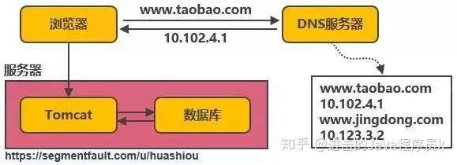

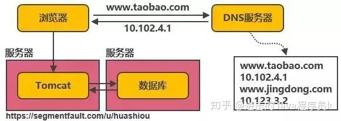

#### :whale: 缓存
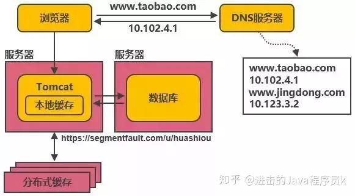

#### :whale: LB -> NGX 7层LB， 
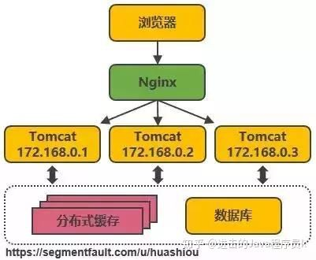

#### :whale: 数据库 加入myCAT做DB读写分离
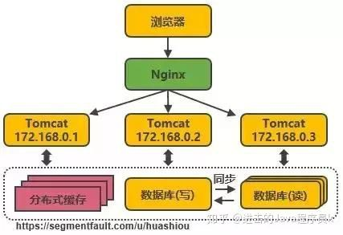

#### :whale: Redis做缓存
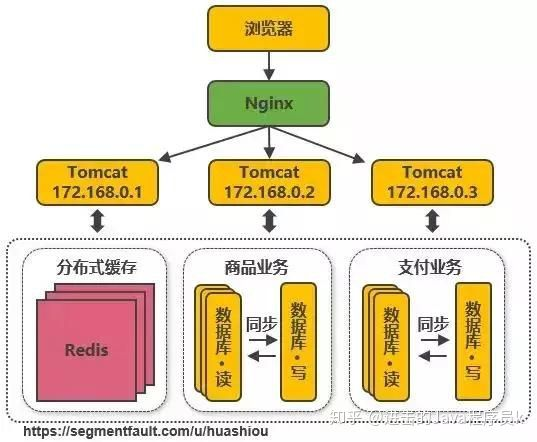

#### :whale: 数据库 业务拆分
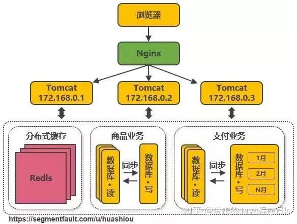

#### :whale: LVS+F5 做4层LB，myCAT表拆分
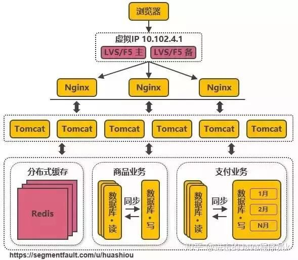

#### :whale: LB DNS RR轮训 跨机房负载均衡 机房级别水平扩展
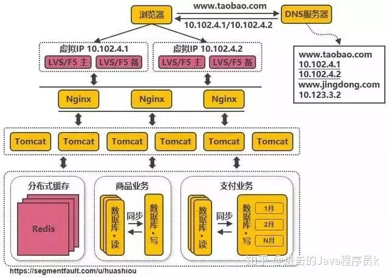

#### :whale: 海量数据 noSQL，hBase
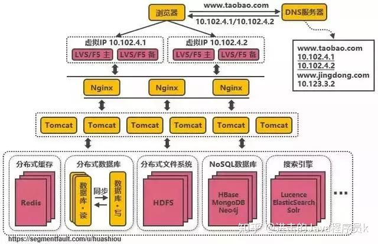

#### :whale: 应用规划、拆分
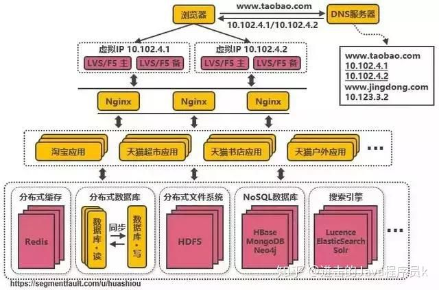

#### :whale: 微服务，公共服务提炼，dubbo，springcloud =》 治理、限流、熔断、降级


#### :whale: 加入服务总线
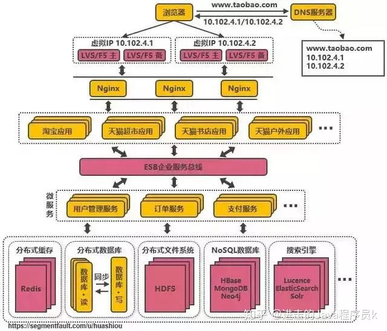

#### :whale: docker管理，屏蔽环境差异，加速部署，提升运维效率，k8s
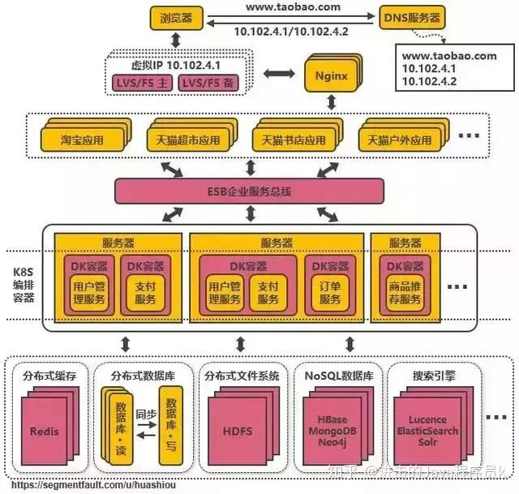

#### :whale: 云部署，CDN+SLB+WAF可以由云服务提供，也可以自己搭建，docker+k8s
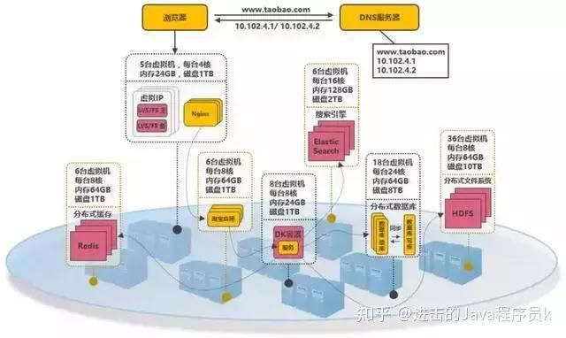


[-](https://zhuanlan.zhihu.com/p/69421196)
