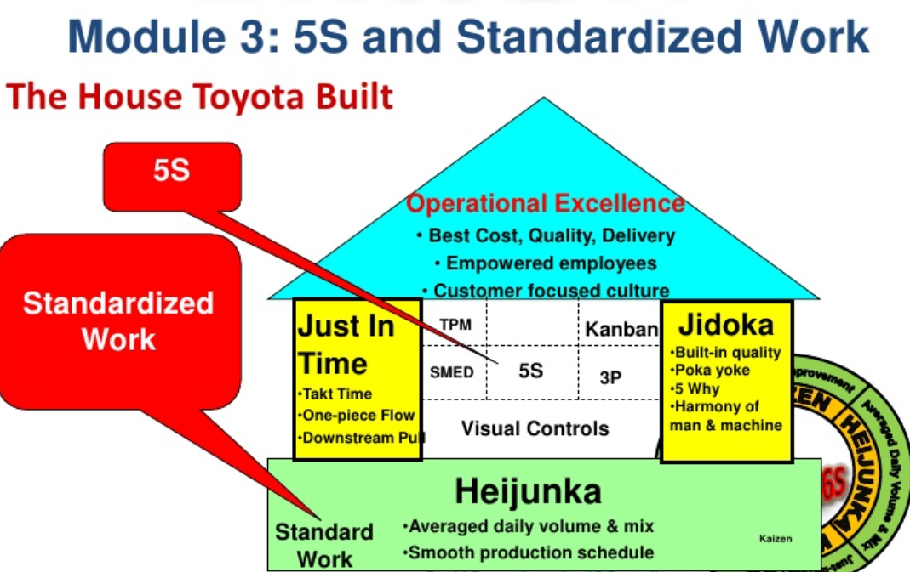

# 精益 & TPS

- 是什么？背景？目标？
- 适用性？

## 是什么

TPS（Toyota Production System, 丰田精益生产系统），这张图形象描写了TPS/Lean Manufacturing/精益生产的逻辑。
房顶，即最终目的，是做到产品具有最高品质，最低价格，最快交付时间。
地基是设备可靠性 （Stability=可靠性）
基础是平稳生产（Heijunka=平准化 + Standardized Work=标准化作业 + Kaizen=持续改善）
顶梁柱是JIT和Jidoka

1. 管理决策以长期理念为基础，及时因此牺牲短期财务目标也在所不惜。
1. 建立连续的作业流以使问题浮现。（单件流）
1. 使用拉动生产方式以避免生产过剩。（看板:内部拉动）(JIT：外部拉动)(milkrun)
1. 使工作负荷平均。（heijunka）
1. 建立立即暂停以解决问题、从一开始就重视质量控制的文化。（jidoka）（TQM）（TPM）
1. 工作的标准化是持续改善与授权员工的基础。（标准化）（全员参与）
1. 通过可视化管理使问题无所隐藏。（目视化）
1. 使用可靠且已经充分测试的技术以协助员工及生产流程。（LCA）
1. 培养公司理念的领袖，使他们能教导其他员工。
1. 培养与发展信奉公司理念的杰出人才与团队。（Team Work）
1. 重视合作伙伴与供应商，激励并协助其改善
1. 亲临现场，彻底了解情况（Gemba）。
1. 制定决策时要稳健，穷尽所有的选择，并征得一致意见；实施决策时要迅速。
1. 通过不断省思与持续改善成为一个学习型组织。(持续改善)

## 适用性

